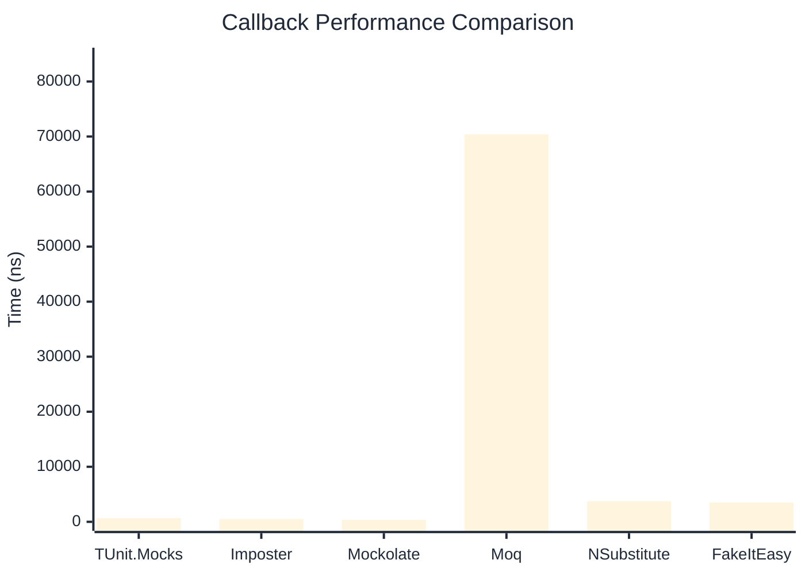
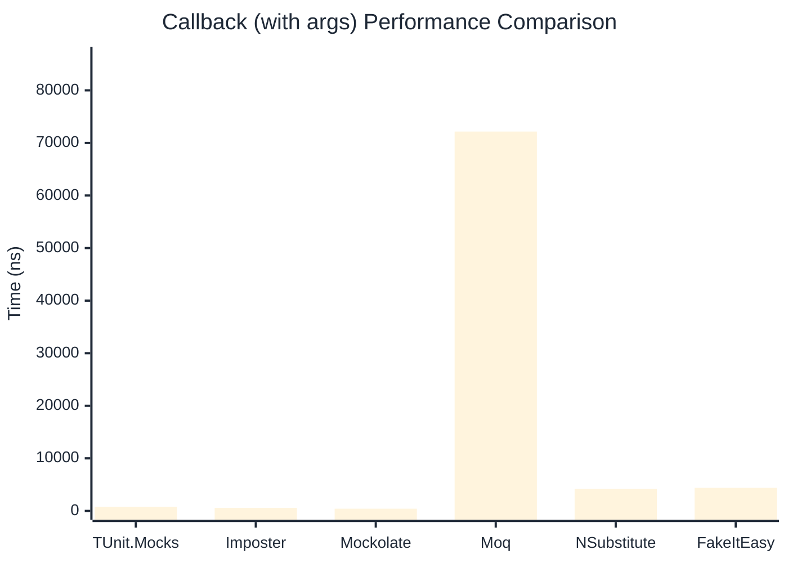

# Callback Benchmark

> Callback registration and execution — comparing **TUnit.Mocks** (source-generated) against runtime proxy-based mocking libraries.

:::info Last Updated
This benchmark was automatically generated on **2026-10-04** from the latest CI run.

**Environment:** Ubuntu Latest • .NET SDK 10.0.401
:::

## 📊 Results

Callback registration and execution:

| Library | Mean | Error | StdDev | Allocated |
|---------|------|-------|--------|-----------|
| **TUnit.Mocks** | 683.2 ns | 4.80 ns | 4.01 ns | 3.12 KB |
| Imposter | 501.2 ns | 4.17 ns | 3.26 ns | 2.66 KB |
| Mockolate | 377.3 ns | 4.57 ns | 4.27 ns | 1.8 KB |
| Moq | 70,398.2 ns | 1,119.08 ns | 992.04 ns | 13.28 KB |
| NSubstitute | 3,741.8 ns | 23.39 ns | 18.26 ns | 7.85 KB |
| FakeItEasy | 3,506.1 ns | 21.17 ns | 17.67 ns | 7.44 KB |

```mermaid
%%{init: {
  'theme':'base',
  'themeVariables': {
    'primaryColor': '#2563eb',
    'primaryTextColor': '#1f2937',
    'primaryBorderColor': '#1e40af',
    'lineColor': '#6b7280',
    'secondaryColor': '#7c3aed',
    'tertiaryColor': '#dc2626',
    'background': '#ffffff',
    'pie1': '#2563eb',
    'pie2': '#7c3aed',
    'pie3': '#dc2626',
    'pie4': '#f59e0b',
    'pie5': '#10b981',
    'pie6': '#06b6d4',
    'pie7': '#ec4899',
    'pie8': '#6366f1'
  }
}}%%
xychart-beta
  title "Callback Performance Comparison"
  x-axis ["TUnit.Mocks", "Imposter", "Mockolate", "Moq", "NSubstitute", "FakeItEasy"]
  y-axis "Time (ns)" 0 --> 84478
  bar [683.2, 501.2, 377.3, 70398.2, 3741.8, 3506.1]
```

---

### with args

| Library | Mean | Error | StdDev | Allocated |
|---------|------|-------|--------|-----------|
| **TUnit.Mocks** | 783.6 ns | 5.80 ns | 5.14 ns | 3.21 KB |
| Imposter | 585.8 ns | 10.13 ns | 9.48 ns | 2.82 KB |
| Mockolate | 421.7 ns | 4.20 ns | 3.50 ns | 1.84 KB |
| Moq | 72,166.0 ns | 1,423.75 ns | 1,582.50 ns | 13.67 KB |
| NSubstitute | 4,186.2 ns | 82.83 ns | 121.40 ns | 8.41 KB |
| FakeItEasy | 4,388.5 ns | 73.59 ns | 68.83 ns | 9.41 KB |

```mermaid
%%{init: {
  'theme':'base',
  'themeVariables': {
    'primaryColor': '#2563eb',
    'primaryTextColor': '#1f2937',
    'primaryBorderColor': '#1e40af',
    'lineColor': '#6b7280',
    'secondaryColor': '#7c3aed',
    'tertiaryColor': '#dc2626',
    'background': '#ffffff',
    'pie1': '#2563eb',
    'pie2': '#7c3aed',
    'pie3': '#dc2626',
    'pie4': '#f59e0b',
    'pie5': '#10b981',
    'pie6': '#06b6d4',
    'pie7': '#ec4899',
    'pie8': '#6366f1'
  }
}}%%
xychart-beta
  title "Callback (with args) Performance Comparison"
  x-axis ["TUnit.Mocks", "Imposter", "Mockolate", "Moq", "NSubstitute", "FakeItEasy"]
  y-axis "Time (ns)" 0 --> 86600
  bar [783.6, 585.8, 421.7, 72166, 4186.2, 4388.5]
```

## 🎯 Key Insights

This benchmark compares **TUnit.Mocks** (source-generated) against runtime proxy-based mocking libraries for callback registration and execution.

---

:::note Methodology
View the [mock benchmarks overview](/docs/benchmarks/mocks) for methodology details and environment information.
:::

*Last generated: 2026-10-04T03:10:54.658Z*
