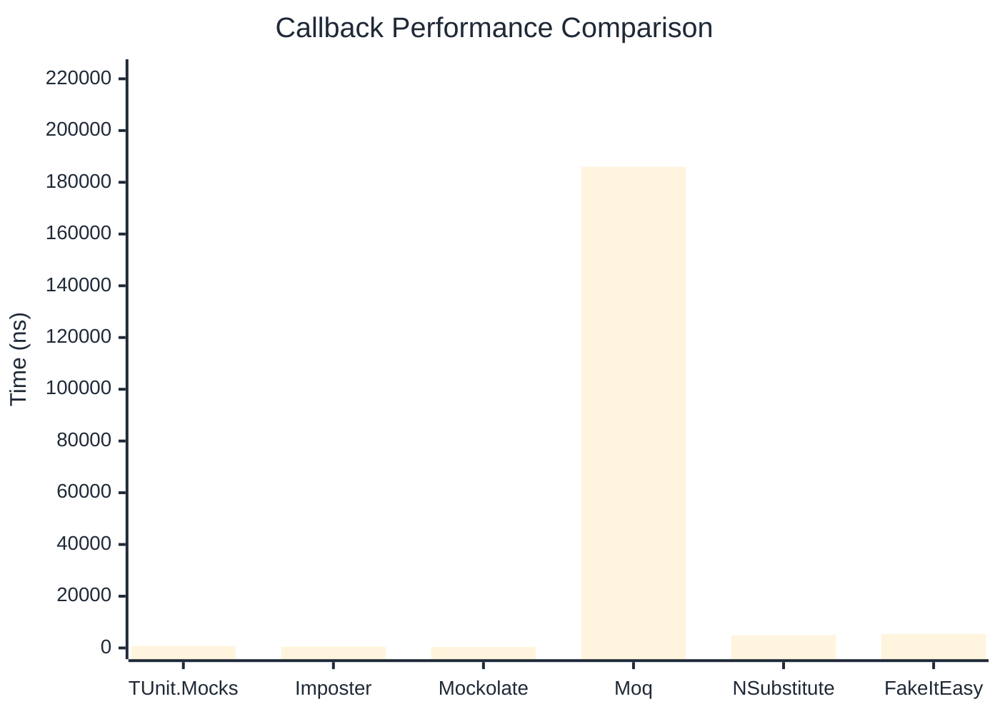

# Callback Benchmark

> Callback registration and execution — comparing **TUnit.Mocks** (source-generated) against runtime proxy-based mocking libraries.

:::info Last Updated
This benchmark was automatically generated on **2026-10-05** from the latest CI run.

**Environment:** Ubuntu Latest • .NET SDK 10.0.401
:::

## 📊 Results

Callback registration and execution:

| Library | Mean | Error | StdDev | Allocated |
|---------|------|-------|--------|-----------|
| **TUnit.Mocks** | 742.6 ns | 10.26 ns | 9.59 ns | 3.12 KB |
| Imposter | 503.9 ns | 3.87 ns | 3.62 ns | 2.66 KB |
| Mockolate | 383.2 ns | 6.20 ns | 5.80 ns | 1.8 KB |
| Moq | 185,983.4 ns | 1,383.99 ns | 1,294.58 ns | 13.14 KB |
| NSubstitute | 4,921.0 ns | 57.12 ns | 53.43 ns | 7.85 KB |
| FakeItEasy | 5,444.1 ns | 101.01 ns | 94.49 ns | 7.44 KB |

```mermaid
%%{init: {
  'theme':'base',
  'themeVariables': {
    'primaryColor': '#2563eb',
    'primaryTextColor': '#1f2937',
    'primaryBorderColor': '#1e40af',
    'lineColor': '#6b7280',
    'secondaryColor': '#7c3aed',
    'tertiaryColor': '#dc2626',
    'background': '#ffffff',
    'pie1': '#2563eb',
    'pie2': '#7c3aed',
    'pie3': '#dc2626',
    'pie4': '#f59e0b',
    'pie5': '#10b981',
    'pie6': '#06b6d4',
    'pie7': '#ec4899',
    'pie8': '#6366f1'
  }
}}%%
xychart-beta
  title "Callback Performance Comparison"
  x-axis ["TUnit.Mocks", "Imposter", "Mockolate", "Moq", "NSubstitute", "FakeItEasy"]
  y-axis "Time (ns)" 0 --> 223181
  bar [742.6, 503.9, 383.2, 185983.4, 4921, 5444.1]
```

---

### with args

| Library | Mean | Error | StdDev | Allocated |
|---------|------|-------|--------|-----------|
| **TUnit.Mocks** | 882.5 ns | 10.07 ns | 9.42 ns | 3.21 KB |
| Imposter | 555.6 ns | 9.36 ns | 8.75 ns | 2.82 KB |
| Mockolate | 390.8 ns | 1.52 ns | 1.42 ns | 1.84 KB |
| Moq | 195,371.4 ns | 1,800.76 ns | 1,684.43 ns | 13.7 KB |
| NSubstitute | 5,609.5 ns | 40.09 ns | 35.54 ns | 8.41 KB |
| FakeItEasy | 6,756.9 ns | 115.39 ns | 107.94 ns | 9.4 KB |

```mermaid
%%{init: {
  'theme':'base',
  'themeVariables': {
    'primaryColor': '#2563eb',
    'primaryTextColor': '#1f2937',
    'primaryBorderColor': '#1e40af',
    'lineColor': '#6b7280',
    'secondaryColor': '#7c3aed',
    'tertiaryColor': '#dc2626',
    'background': '#ffffff',
    'pie1': '#2563eb',
    'pie2': '#7c3aed',
    'pie3': '#dc2626',
    'pie4': '#f59e0b',
    'pie5': '#10b981',
    'pie6': '#06b6d4',
    'pie7': '#ec4899',
    'pie8': '#6366f1'
  }
}}%%
xychart-beta
  title "Callback (with args) Performance Comparison"
  x-axis ["TUnit.Mocks", "Imposter", "Mockolate", "Moq", "NSubstitute", "FakeItEasy"]
  y-axis "Time (ns)" 0 --> 234446
  bar [882.5, 555.6, 390.8, 195371.4, 5609.5, 6756.9]
```

## 🎯 Key Insights

This benchmark compares **TUnit.Mocks** (source-generated) against runtime proxy-based mocking libraries for callback registration and execution.

---

:::note Methodology
View the [mock benchmarks overview](/docs/benchmarks/mocks) for methodology details and environment information.
:::

*Last generated: 2026-10-05T02:45:14.260Z*
