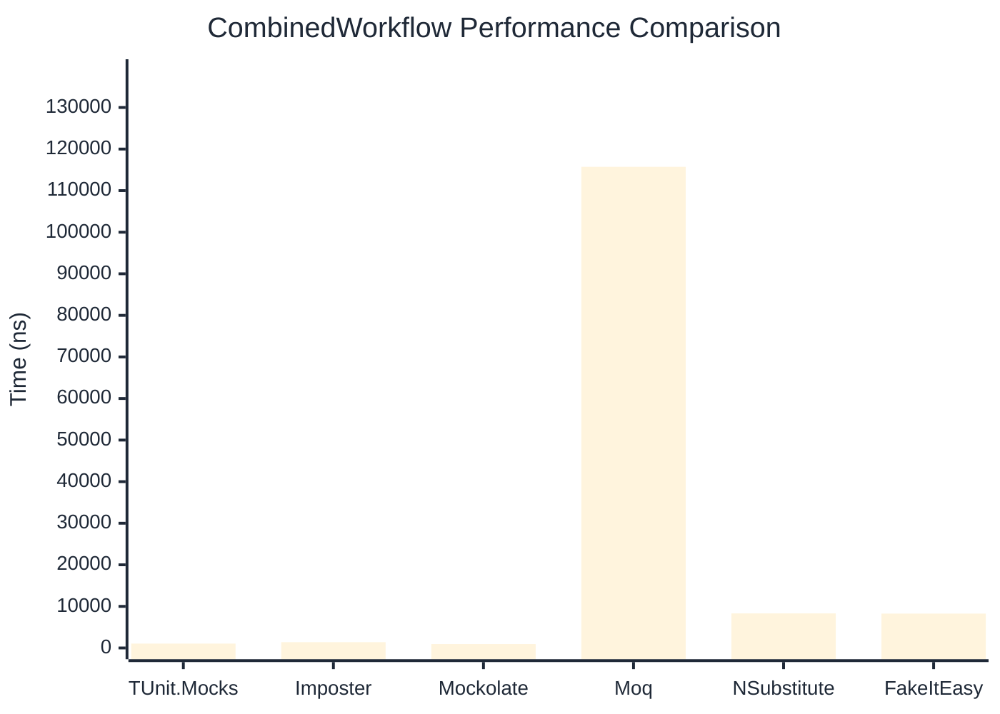

# CombinedWorkflow Benchmark

> Full workflow: create → setup → invoke → verify — comparing **TUnit.Mocks** (source-generated) against runtime proxy-based mocking libraries.

:::info Last Updated
This benchmark was automatically generated on **2026-06-13** from the latest CI run.

**Environment:** Ubuntu Latest • .NET SDK 10.0.301
:::

## 📊 Results

Full workflow: create → setup → invoke → verify:

| Library | Mean | Error | StdDev | Allocated |
|---------|------|-------|--------|-----------|
| **TUnit.Mocks** | 1,051.0 ns | 20.84 ns | 24.00 ns | 6.23 KB |
| Imposter | 1,394.8 ns | 27.79 ns | 23.20 ns | 15.71 KB |
| Mockolate | 936.9 ns | 10.74 ns | 10.04 ns | 7.63 KB |
| Moq | 115,727.8 ns | 2,252.21 ns | 2,503.32 ns | 36.18 KB |
| NSubstitute | 8,308.9 ns | 158.21 ns | 147.99 ns | 26.72 KB |
| FakeItEasy | 8,260.3 ns | 154.40 ns | 128.93 ns | 25.6 KB |

## 🎯 Key Insights

This benchmark compares **TUnit.Mocks** (source-generated) against runtime proxy-based mocking libraries for full workflow: create → setup → invoke → verify.

---

:::note Methodology
View the [mock benchmarks overview](/docs/benchmarks/mocks) for methodology details and environment information.
:::

*Last generated: 2026-06-13T03:28:23.194Z*
