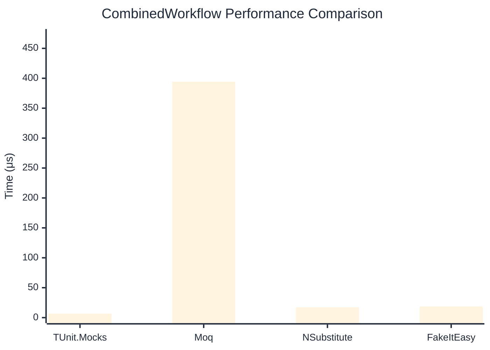

# CombinedWorkflow Benchmark

:::info Last Updated
This benchmark was automatically generated on **2026-03-28** from the latest CI run.

**Environment:** Ubuntu Latest • .NET SDK 10.0.201
:::

## 📊 Results

Full workflow: create → setup → invoke → verify:

| Method | Mean | Error | StdDev | Allocated |
|--------|------|-------|--------|-----------|
| **TUnit.Mocks** | 6.513 μs | 0.1292 μs | 0.2329 μs | 15.85 KB |
| Moq | 394.164 μs | 4.7436 μs | 4.2051 μs | 36.45 KB |
| NSubstitute | 17.171 μs | 0.0753 μs | 0.0667 μs | 26.72 KB |
| FakeItEasy | 18.689 μs | 0.1373 μs | 0.1284 μs | 25.63 KB |

## 📈 Visual Comparison

## 🎯 Key Insights

This benchmark compares **TUnit.Mocks** (source-generated) against runtime proxy-based mocking libraries for full workflow: create → setup → invoke → verify.

---

:::note Methodology
View the [mock benchmarks overview](/docs/benchmarks/mocks) for methodology details and environment information.
:::

*Last generated: 2026-03-28T22:34:52.303Z*
