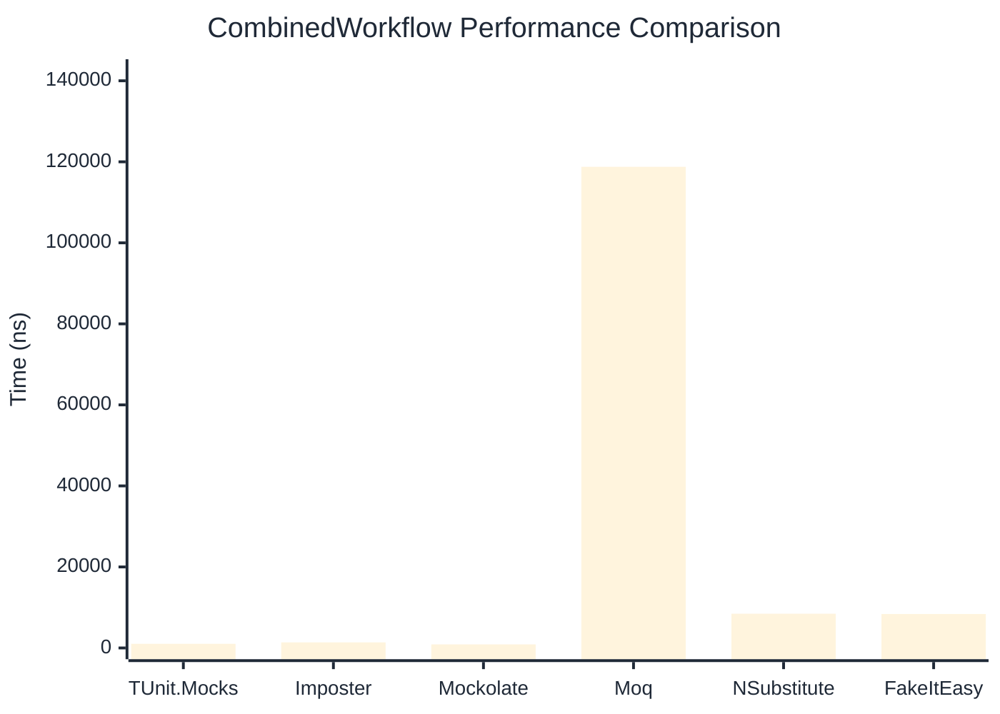

# CombinedWorkflow Benchmark

> Full workflow: create → setup → invoke → verify — comparing **TUnit.Mocks** (source-generated) against runtime proxy-based mocking libraries.

:::info Last Updated
This benchmark was automatically generated on **2026-06-28** from the latest CI run.

**Environment:** Ubuntu Latest • .NET SDK 10.0.301
:::

## 📊 Results

Full workflow: create → setup → invoke → verify:

| Library | Mean | Error | StdDev | Allocated |
|---------|------|-------|--------|-----------|
| **TUnit.Mocks** | 1,026.9 ns | 19.63 ns | 23.37 ns | 6.23 KB |
| Imposter | 1,373.1 ns | 27.08 ns | 30.10 ns | 15.71 KB |
| Mockolate | 882.5 ns | 16.08 ns | 24.55 ns | 7.36 KB |
| Moq | 118,764.5 ns | 2,185.58 ns | 2,044.39 ns | 36.19 KB |
| NSubstitute | 8,453.9 ns | 76.99 ns | 64.29 ns | 26.72 KB |
| FakeItEasy | 8,383.5 ns | 134.32 ns | 125.65 ns | 25.81 KB |

## 🎯 Key Insights

This benchmark compares **TUnit.Mocks** (source-generated) against runtime proxy-based mocking libraries for full workflow: create → setup → invoke → verify.

---

:::note Methodology
View the [mock benchmarks overview](/docs/benchmarks/mocks) for methodology details and environment information.
:::

*Last generated: 2026-06-28T03:33:50.965Z*
