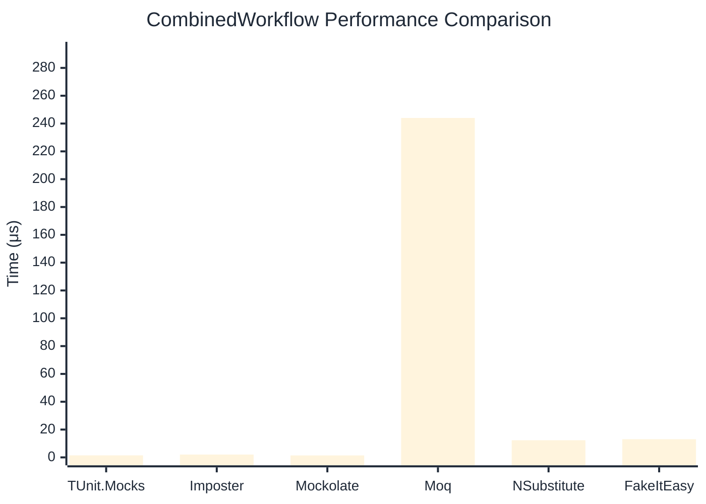

# CombinedWorkflow Benchmark

> Full workflow: create → setup → invoke → verify — comparing **TUnit.Mocks** (source-generated) against runtime proxy-based mocking libraries.

:::info Last Updated
This benchmark was automatically generated on **2026-06-03** from the latest CI run.

**Environment:** Ubuntu Latest • .NET SDK 10.0.300
:::

## 📊 Results

Full workflow: create → setup → invoke → verify:

| Library | Mean | Error | StdDev | Allocated |
|---------|------|-------|--------|-----------|
| **TUnit.Mocks** | 1.451 μs | 0.0189 μs | 0.0168 μs | 6.11 KB |
| Imposter | 2.032 μs | 0.0402 μs | 0.0625 μs | 15.71 KB |
| Mockolate | 1.408 μs | 0.0265 μs | 0.0248 μs | 7.63 KB |
| Moq | 244.015 μs | 0.8183 μs | 0.7254 μs | 36.27 KB |
| NSubstitute | 12.318 μs | 0.2318 μs | 0.2277 μs | 26.72 KB |
| FakeItEasy | 13.067 μs | 0.2515 μs | 0.2352 μs | 25.74 KB |

## 🎯 Key Insights

This benchmark compares **TUnit.Mocks** (source-generated) against runtime proxy-based mocking libraries for full workflow: create → setup → invoke → verify.

---

:::note Methodology
View the [mock benchmarks overview](/docs/benchmarks/mocks) for methodology details and environment information.
:::

*Last generated: 2026-06-03T03:30:19.511Z*
