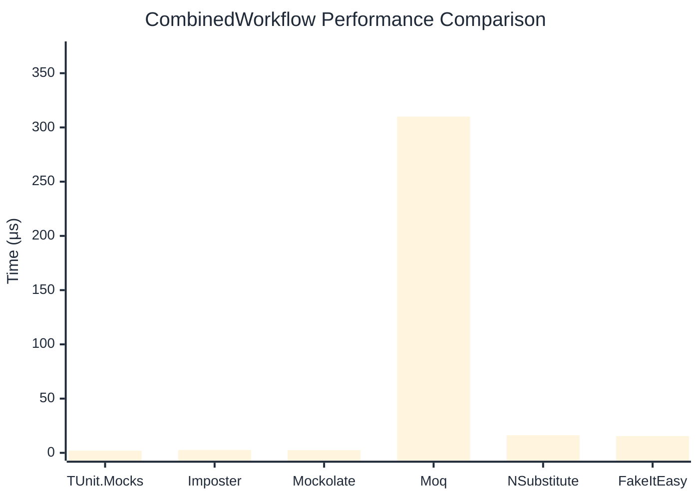

# CombinedWorkflow Benchmark

:::info Last Updated
This benchmark was automatically generated on **2026-04-16** from the latest CI run.

**Environment:** Ubuntu Latest • .NET SDK 10.0.202
:::

## 📊 Results

Full workflow: create → setup → invoke → verify:

| Library | Mean | Error | StdDev | Allocated |
|---------|------|-------|--------|-----------|
| **TUnit.Mocks** | 1.992 μs | 0.0301 μs | 0.0281 μs | 6.34 KB |
| Imposter | 2.628 μs | 0.0513 μs | 0.0549 μs | 15.71 KB |
| Mockolate | 2.479 μs | 0.0239 μs | 0.0224 μs | 7.06 KB |
| Moq | 309.995 μs | 2.2459 μs | 2.1009 μs | 36.16 KB |
| NSubstitute | 16.228 μs | 0.3080 μs | 0.3296 μs | 26.72 KB |
| FakeItEasy | 15.431 μs | 0.3011 μs | 0.2958 μs | 25.52 KB |

## 🎯 Key Insights

This benchmark compares **TUnit.Mocks** (source-generated) against runtime proxy-based mocking libraries for full workflow: create → setup → invoke → verify.

---

:::note Methodology
View the [mock benchmarks overview](/docs/benchmarks/mocks) for methodology details and environment information.
:::

*Last generated: 2026-04-16T03:23:00.282Z*
