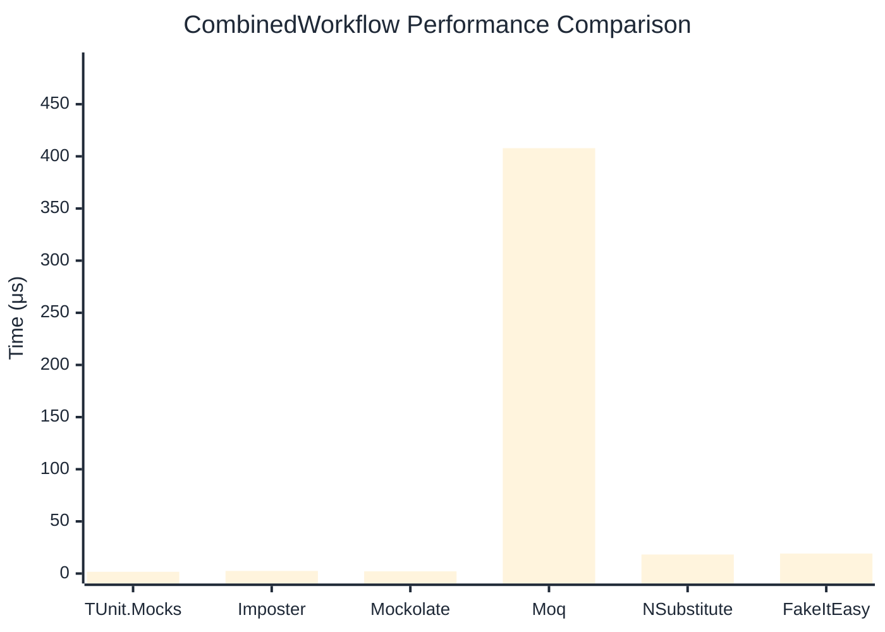

# CombinedWorkflow Benchmark

:::info Last Updated
This benchmark was automatically generated on **2026-05-09** from the latest CI run.

**Environment:** Ubuntu Latest • .NET SDK 10.0.203
:::

## 📊 Results

Full workflow: create → setup → invoke → verify:

| Library | Mean | Error | StdDev | Allocated |
|---------|------|-------|--------|-----------|
| **TUnit.Mocks** | 1.680 μs | 0.0043 μs | 0.0033 μs | 5.8 KB |
| Imposter | 2.495 μs | 0.0134 μs | 0.0126 μs | 15.71 KB |
| Mockolate | 2.141 μs | 0.0186 μs | 0.0165 μs | 8.61 KB |
| Moq | 407.841 μs | 2.6241 μs | 2.3262 μs | 36.44 KB |
| NSubstitute | 18.240 μs | 0.3458 μs | 0.3396 μs | 26.72 KB |
| FakeItEasy | 19.172 μs | 0.2279 μs | 0.2132 μs | 25.52 KB |

## 🎯 Key Insights

This benchmark compares **TUnit.Mocks** (source-generated) against runtime proxy-based mocking libraries for full workflow: create → setup → invoke → verify.

---

:::note Methodology
View the [mock benchmarks overview](/docs/benchmarks/mocks) for methodology details and environment information.
:::

*Last generated: 2026-05-09T03:26:33.451Z*
