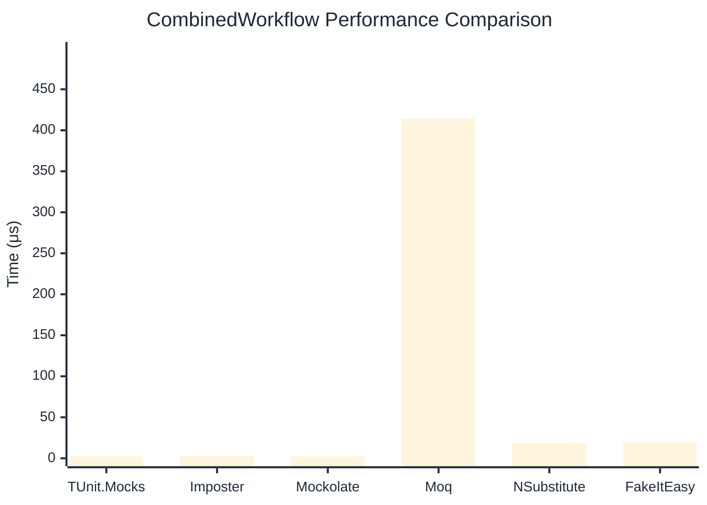

# CombinedWorkflow Benchmark

> Full workflow: create → setup → invoke → verify — comparing **TUnit.Mocks** (source-generated) against runtime proxy-based mocking libraries.

:::info Last Updated
This benchmark was automatically generated on **2026-06-11** from the latest CI run.

**Environment:** Ubuntu Latest • .NET SDK 10.0.301
:::

## 📊 Results

Full workflow: create → setup → invoke → verify:

| Library | Mean | Error | StdDev | Allocated |
|---------|------|-------|--------|-----------|
| **TUnit.Mocks** | 2.066 μs | 0.0217 μs | 0.0192 μs | 6.21 KB |
| Imposter | 3.070 μs | 0.0609 μs | 0.0813 μs | 15.71 KB |
| Mockolate | 2.019 μs | 0.0213 μs | 0.0189 μs | 7.63 KB |
| Moq | 414.368 μs | 2.1959 μs | 2.0540 μs | 36.16 KB |
| NSubstitute | 18.481 μs | 0.1274 μs | 0.1192 μs | 26.72 KB |
| FakeItEasy | 19.779 μs | 0.3731 μs | 0.3490 μs | 25.52 KB |

## 🎯 Key Insights

This benchmark compares **TUnit.Mocks** (source-generated) against runtime proxy-based mocking libraries for full workflow: create → setup → invoke → verify.

---

:::note Methodology
View the [mock benchmarks overview](/docs/benchmarks/mocks) for methodology details and environment information.
:::

*Last generated: 2026-06-11T03:26:37.062Z*
