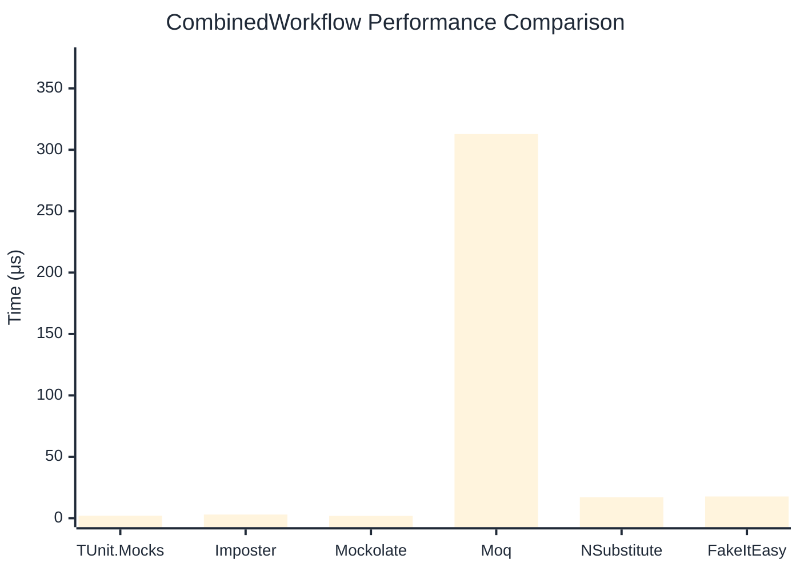

# CombinedWorkflow Benchmark

:::info Last Updated
This benchmark was automatically generated on **2026-05-24** from the latest CI run.

**Environment:** Ubuntu Latest • .NET SDK 10.0.300
:::

## 📊 Results

Full workflow: create → setup → invoke → verify:

| Library | Mean | Error | StdDev | Allocated |
|---------|------|-------|--------|-----------|
| **TUnit.Mocks** | 2.024 μs | 0.0169 μs | 0.0158 μs | 6.11 KB |
| Imposter | 2.960 μs | 0.0348 μs | 0.0308 μs | 15.71 KB |
| Mockolate | 1.855 μs | 0.0151 μs | 0.0141 μs | 7.63 KB |
| Moq | 312.804 μs | 1.2387 μs | 1.0344 μs | 36.4 KB |
| NSubstitute | 17.013 μs | 0.1191 μs | 0.1055 μs | 26.72 KB |
| FakeItEasy | 17.683 μs | 0.0731 μs | 0.0648 μs | 25.5 KB |

## 🎯 Key Insights

This benchmark compares **TUnit.Mocks** (source-generated) against runtime proxy-based mocking libraries for full workflow: create → setup → invoke → verify.

---

:::note Methodology
View the [mock benchmarks overview](/docs/benchmarks/mocks) for methodology details and environment information.
:::

*Last generated: 2026-05-24T03:32:03.972Z*
