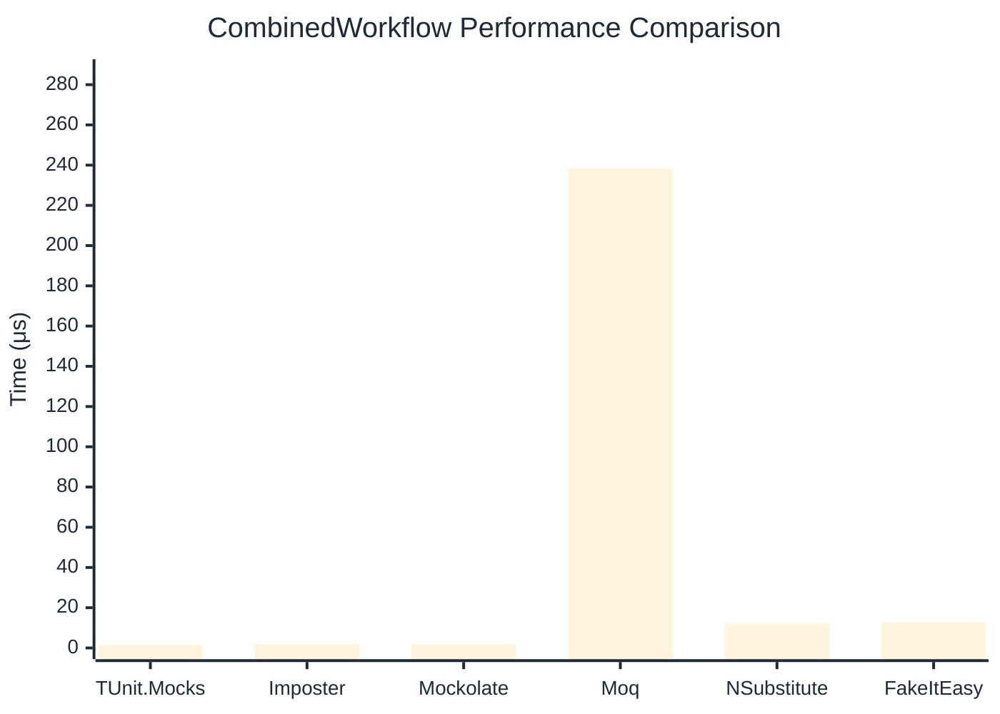

# CombinedWorkflow Benchmark

:::info Last Updated
This benchmark was automatically generated on **2026-04-23** from the latest CI run.

**Environment:** Ubuntu Latest • .NET SDK 10.0.203
:::

## 📊 Results

Full workflow: create → setup → invoke → verify:

| Library | Mean | Error | StdDev | Allocated |
|---------|------|-------|--------|-----------|
| **TUnit.Mocks** | 1.480 μs | 0.0155 μs | 0.0145 μs | 6.34 KB |
| Imposter | 2.015 μs | 0.0383 μs | 0.0377 μs | 15.71 KB |
| Mockolate | 1.916 μs | 0.0179 μs | 0.0167 μs | 7.09 KB |
| Moq | 238.385 μs | 0.8827 μs | 0.7825 μs | 36.16 KB |
| NSubstitute | 12.387 μs | 0.0926 μs | 0.0866 μs | 26.72 KB |
| FakeItEasy | 12.854 μs | 0.2553 μs | 0.2508 μs | 25.64 KB |

## 🎯 Key Insights

This benchmark compares **TUnit.Mocks** (source-generated) against runtime proxy-based mocking libraries for full workflow: create → setup → invoke → verify.

---

:::note Methodology
View the [mock benchmarks overview](/docs/benchmarks/mocks) for methodology details and environment information.
:::

*Last generated: 2026-04-23T03:25:34.373Z*
