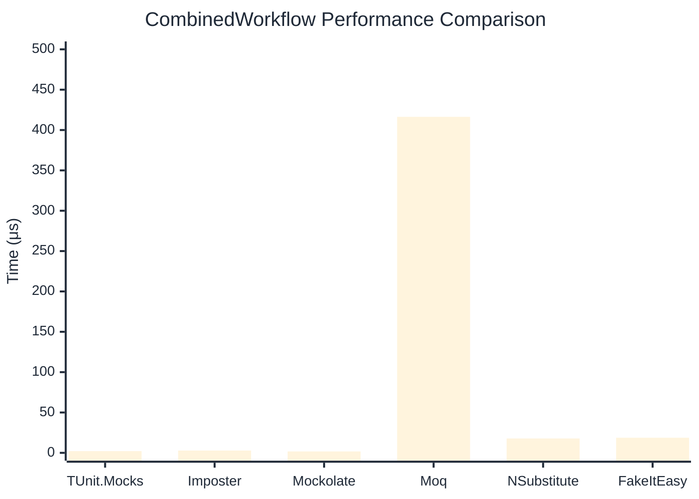

# CombinedWorkflow Benchmark

> Full workflow: create → setup → invoke → verify — comparing **TUnit.Mocks** (source-generated) against runtime proxy-based mocking libraries.

:::info Last Updated
This benchmark was automatically generated on **2026-07-01** from the latest CI run.

**Environment:** Ubuntu Latest • .NET SDK 10.0.301
:::

## 📊 Results

Full workflow: create → setup → invoke → verify:

| Library | Mean | Error | StdDev | Allocated |
|---------|------|-------|--------|-----------|
| **TUnit.Mocks** | 2.115 μs | 0.0366 μs | 0.0343 μs | 6.23 KB |
| Imposter | 2.841 μs | 0.0563 μs | 0.1493 μs | 15.71 KB |
| Mockolate | 1.765 μs | 0.0254 μs | 0.0212 μs | 7.36 KB |
| Moq | 416.331 μs | 3.7703 μs | 3.3423 μs | 36.65 KB |
| NSubstitute | 17.815 μs | 0.1622 μs | 0.1517 μs | 26.72 KB |
| FakeItEasy | 18.735 μs | 0.2936 μs | 0.2746 μs | 25.63 KB |

## 🎯 Key Insights

This benchmark compares **TUnit.Mocks** (source-generated) against runtime proxy-based mocking libraries for full workflow: create → setup → invoke → verify.

---

:::note Methodology
View the [mock benchmarks overview](/docs/benchmarks/mocks) for methodology details and environment information.
:::

*Last generated: 2026-07-01T03:29:08.803Z*
