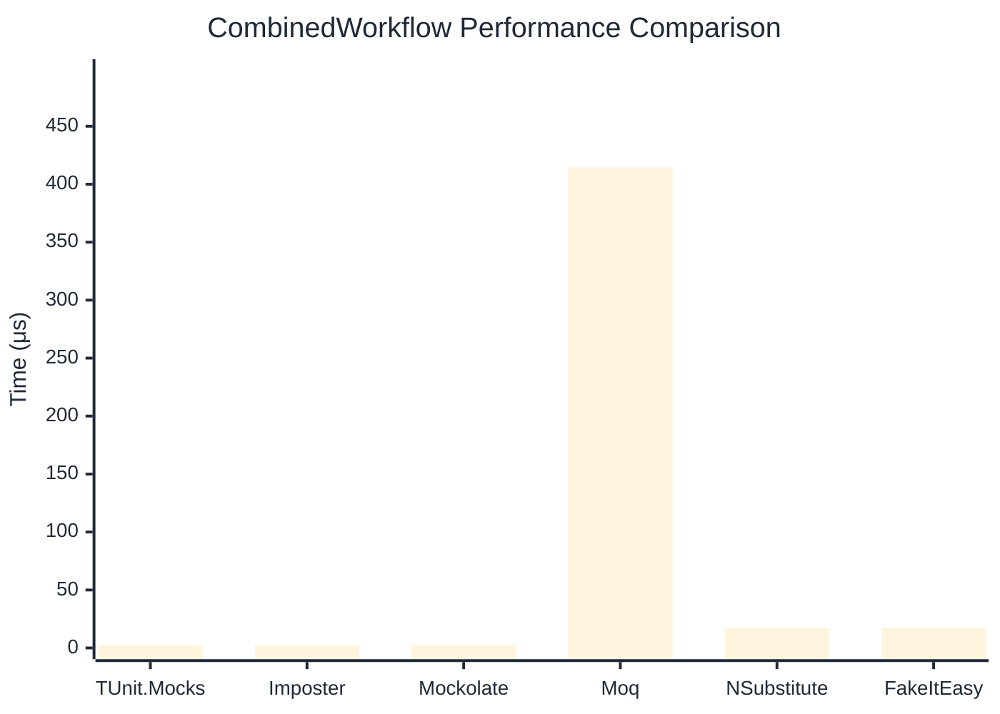

# CombinedWorkflow Benchmark

:::info Last Updated
This benchmark was automatically generated on **2026-03-30** from the latest CI run.

**Environment:** Ubuntu Latest • .NET SDK 10.0.201
:::

## 📊 Results

Full workflow: create → setup → invoke → verify:

| Library | Mean | Error | StdDev | Allocated |
|---------|------|-------|--------|-----------|
| **TUnit.Mocks** | 2.472 μs | 0.0282 μs | 0.0264 μs | 8.77 KB |
| Imposter | 2.598 μs | 0.0489 μs | 0.0503 μs | 15.71 KB |
| Mockolate | 2.504 μs | 0.0497 μs | 0.0488 μs | 6.92 KB |
| Moq | 414.451 μs | 2.0295 μs | 1.8984 μs | 36.16 KB |
| NSubstitute | 17.237 μs | 0.1351 μs | 0.1264 μs | 26.72 KB |
| FakeItEasy | 17.193 μs | 0.2083 μs | 0.1949 μs | 25.52 KB |

## 🎯 Key Insights

This benchmark compares **TUnit.Mocks** (source-generated) against runtime proxy-based mocking libraries for full workflow: create → setup → invoke → verify.

---

:::note Methodology
View the [mock benchmarks overview](/docs/benchmarks/mocks) for methodology details and environment information.
:::

*Last generated: 2026-03-30T21:56:59.028Z*
