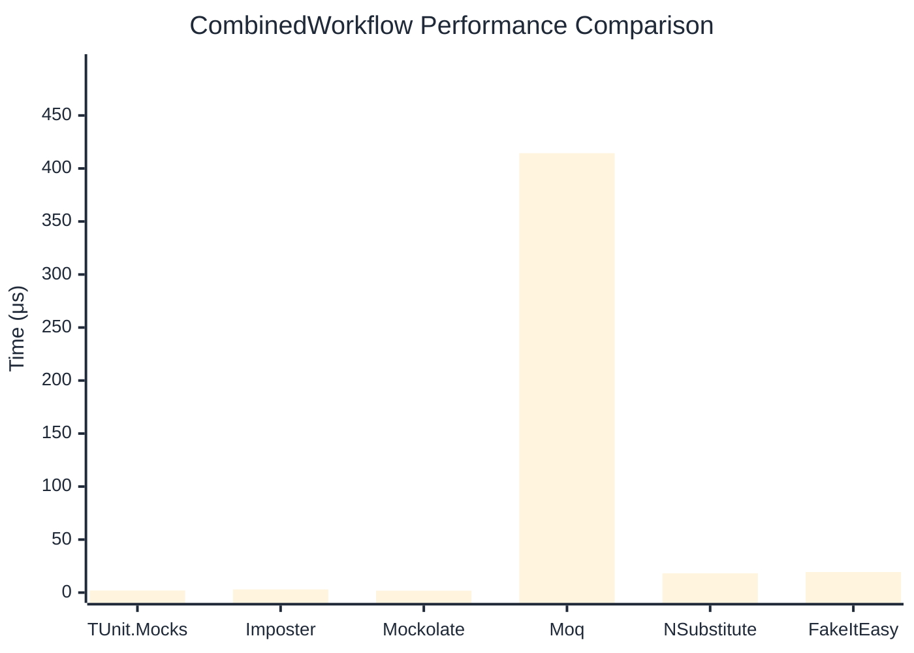

# CombinedWorkflow Benchmark

> Full workflow: create → setup → invoke → verify — comparing **TUnit.Mocks** (source-generated) against runtime proxy-based mocking libraries.

:::info Last Updated
This benchmark was automatically generated on **2026-08-01** from the latest CI run.

**Environment:** Ubuntu Latest • .NET SDK 10.0.302
:::

## 📊 Results

Full workflow: create → setup → invoke → verify:

| Library | Mean | Error | StdDev | Allocated |
|---------|------|-------|--------|-----------|
| **TUnit.Mocks** | 1.971 μs | 0.0268 μs | 0.0237 μs | 6.23 KB |
| Imposter | 2.987 μs | 0.0492 μs | 0.0460 μs | 15.71 KB |
| Mockolate | 1.796 μs | 0.0286 μs | 0.0254 μs | 7.36 KB |
| Moq | 414.416 μs | 4.0754 μs | 3.8122 μs | 36.27 KB |
| NSubstitute | 18.204 μs | 0.1236 μs | 0.1157 μs | 26.72 KB |
| FakeItEasy | 19.398 μs | 0.2394 μs | 0.2239 μs | 25.63 KB |

```mermaid
%%{init: {
  'theme':'base',
  'themeVariables': {
    'primaryColor': '#2563eb',
    'primaryTextColor': '#1f2937',
    'primaryBorderColor': '#1e40af',
    'lineColor': '#6b7280',
    'secondaryColor': '#7c3aed',
    'tertiaryColor': '#dc2626',
    'background': '#ffffff',
    'pie1': '#2563eb',
    'pie2': '#7c3aed',
    'pie3': '#dc2626',
    'pie4': '#f59e0b',
    'pie5': '#10b981',
    'pie6': '#06b6d4',
    'pie7': '#ec4899',
    'pie8': '#6366f1'
  }
}}%%
xychart-beta
  title "CombinedWorkflow Performance Comparison"
  x-axis ["TUnit.Mocks", "Imposter", "Mockolate", "Moq", "NSubstitute", "FakeItEasy"]
  y-axis "Time (μs)" 0 --> 498
  bar [1.971, 2.987, 1.796, 414.416, 18.204, 19.398]
```

## 🎯 Key Insights

This benchmark compares **TUnit.Mocks** (source-generated) against runtime proxy-based mocking libraries for full workflow: create → setup → invoke → verify.

---

:::note Methodology
View the [mock benchmarks overview](/docs/benchmarks/mocks) for methodology details and environment information.
:::

*Last generated: 2026-08-01T03:21:53.196Z*
