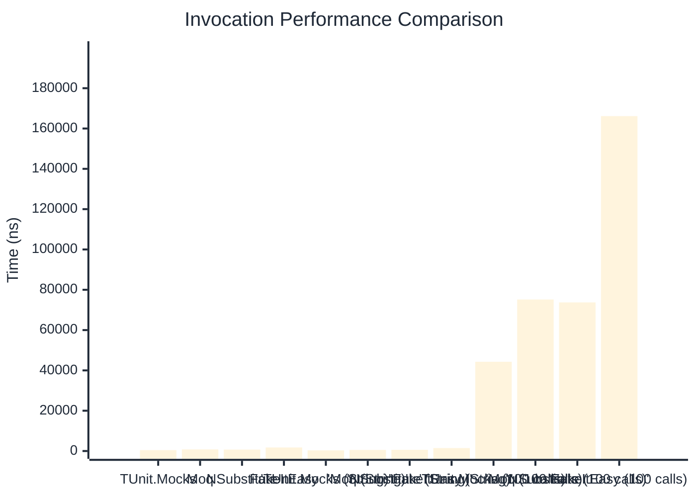

# Invocation Benchmark

:::info Last Updated
This benchmark was automatically generated on **2026-03-29** from the latest CI run.

**Environment:** Ubuntu Latest • .NET SDK 10.0.201
:::

## 📊 Results

Calling methods on mock objects:

| Method | Mean | Error | StdDev | Allocated |
|--------|------|-------|--------|-----------|
| **TUnit.Mocks** | 466.6 ns | 124.67 ns | 6.83 ns | 224 B |
| Moq | 811.6 ns | 230.66 ns | 12.64 ns | 376 B |
| NSubstitute | 731.3 ns | 408.83 ns | 22.41 ns | 304 B |
| FakeItEasy | 1,756.0 ns | 418.56 ns | 22.94 ns | 944 B |
| **'TUnit.Mocks (String)'** | 324.4 ns | 88.45 ns | 4.85 ns | 160 B |
| 'Moq (String)' | 543.8 ns | 404.28 ns | 22.16 ns | 296 B |
| 'NSubstitute (String)' | 621.0 ns | 158.06 ns | 8.66 ns | 328 B |
| 'FakeItEasy (String)' | 1,473.2 ns | 67.35 ns | 3.69 ns | 776 B |
| **'TUnit.Mocks (100 calls)'** | 44,280.6 ns | 14,518.44 ns | 795.80 ns | 23296 B |
| 'Moq (100 calls)' | 75,180.1 ns | 27,129.31 ns | 1,487.05 ns | 37600 B |
| 'NSubstitute (100 calls)' | 73,737.1 ns | 8,160.85 ns | 447.32 ns | 36448 B |
| 'FakeItEasy (100 calls)' | 166,152.5 ns | 62,280.93 ns | 3,413.83 ns | 94400 B |

## 📈 Visual Comparison

## 🎯 Key Insights

This benchmark compares **TUnit.Mocks** (source-generated) against runtime proxy-based mocking libraries for calling methods on mock objects.

---

:::note Methodology
View the [mock benchmarks overview](/docs/benchmarks/mocks) for methodology details and environment information.
:::

*Last generated: 2026-03-29T03:29:47.876Z*
