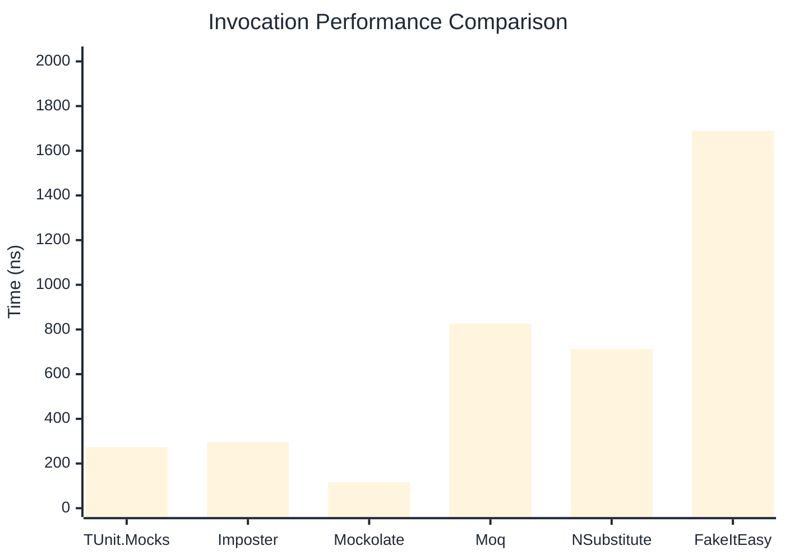

# Invocation Benchmark

> Calling methods on mock objects — comparing **TUnit.Mocks** (source-generated) against runtime proxy-based mocking libraries.

:::info Last Updated
This benchmark was automatically generated on **2026-07-17** from the latest CI run.

**Environment:** Ubuntu Latest • .NET SDK 10.0.302
:::

## 📊 Results

Calling methods on mock objects:

| Library | Mean | Error | StdDev | Allocated |
|---------|------|-------|--------|-----------|
| **TUnit.Mocks** | 273.21 ns | 54.95 ns | 3.012 ns | 128 B |
| Imposter | 295.60 ns | 64.58 ns | 3.540 ns | 168 B |
| Mockolate | 116.27 ns | 54.60 ns | 2.993 ns | 84 B |
| Moq | 826.32 ns | 428.39 ns | 23.482 ns | 376 B |
| NSubstitute | 711.93 ns | 117.66 ns | 6.449 ns | 304 B |
| FakeItEasy | 1,688.72 ns | 615.50 ns | 33.738 ns | 944 B |

---

### String

| Library | Mean | Error | StdDev | Allocated |
|---------|------|-------|--------|-----------|
| **TUnit.Mocks** | 167.79 ns | 78.26 ns | 4.290 ns | 96 B |
| Imposter | 296.53 ns | 25.92 ns | 1.421 ns | 168 B |
| Mockolate | 93.26 ns | 21.15 ns | 1.159 ns | 60 B |
| Moq | 549.13 ns | 106.61 ns | 5.843 ns | 296 B |
| NSubstitute | 636.74 ns | 195.01 ns | 10.689 ns | 272 B |
| FakeItEasy | 1,580.87 ns | 263.68 ns | 14.453 ns | 776 B |

---

### 100 calls

| Library | Mean | Error | StdDev | Allocated |
|---------|------|-------|--------|-----------|
| **TUnit.Mocks** | 27,119.94 ns | 11,658.13 ns | 639.021 ns | 12736 B |
| Imposter | 28,877.92 ns | 6,810.75 ns | 373.320 ns | 16800 B |
| Mockolate | 10,425.92 ns | 3,862.76 ns | 211.731 ns | 8400 B |
| Moq | 80,932.02 ns | 4,243.47 ns | 232.599 ns | 37600 B |
| NSubstitute | 70,858.46 ns | 4,713.41 ns | 258.358 ns | 30848 B |
| FakeItEasy | 178,405.95 ns | 6,746.21 ns | 369.782 ns | 94400 B |

## 🎯 Key Insights

This benchmark compares **TUnit.Mocks** (source-generated) against runtime proxy-based mocking libraries for calling methods on mock objects.

---

:::note Methodology
View the [mock benchmarks overview](/docs/benchmarks/mocks) for methodology details and environment information.
:::

*Last generated: 2026-07-17T03:20:48.806Z*
