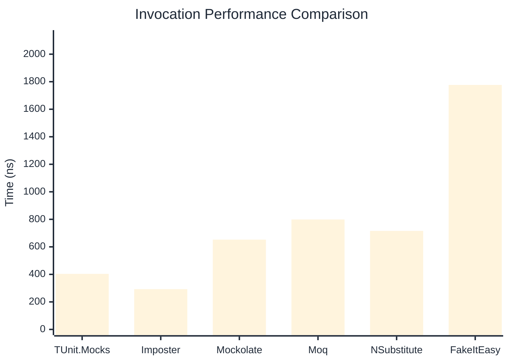
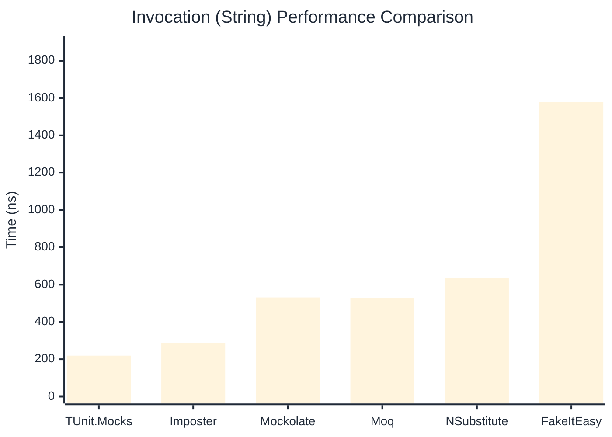
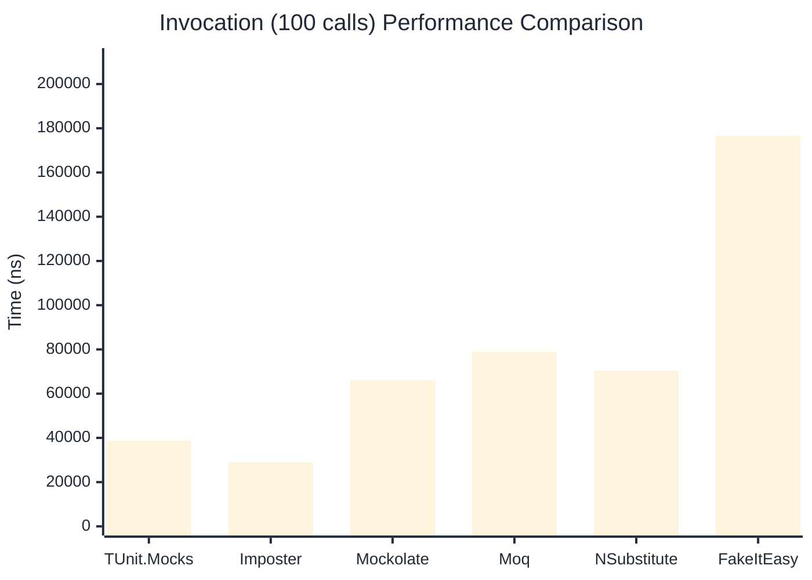

# Invocation Benchmark

:::info Last Updated
This benchmark was automatically generated on **2026-04-02** from the latest CI run.

**Environment:** Ubuntu Latest • .NET SDK 10.0.201
:::

## 📊 Results

Calling methods on mock objects:

| Library | Mean | Error | StdDev | Allocated |
|---------|------|-------|--------|-----------|
| **TUnit.Mocks** | 403.7 ns | 62.44 ns | 3.42 ns | 176 B |
| Imposter | 292.7 ns | 101.16 ns | 5.55 ns | 168 B |
| Mockolate | 652.4 ns | 147.38 ns | 8.08 ns | 640 B |
| Moq | 798.9 ns | 159.21 ns | 8.73 ns | 376 B |
| NSubstitute | 716.0 ns | 144.96 ns | 7.95 ns | 304 B |
| FakeItEasy | 1,776.7 ns | 252.35 ns | 13.83 ns | 944 B |

---

### String

| Library | Mean | Error | StdDev | Allocated |
|---------|------|-------|--------|-----------|
| **TUnit.Mocks** | 219.6 ns | 127.03 ns | 6.96 ns | 112 B |
| Imposter | 289.0 ns | 51.45 ns | 2.82 ns | 168 B |
| Mockolate | 531.5 ns | 331.71 ns | 18.18 ns | 520 B |
| Moq | 527.2 ns | 131.47 ns | 7.21 ns | 296 B |
| NSubstitute | 634.5 ns | 72.26 ns | 3.96 ns | 272 B |
| FakeItEasy | 1,577.7 ns | 413.54 ns | 22.67 ns | 776 B |

---

### 100 calls

| Library | Mean | Error | StdDev | Allocated |
|---------|------|-------|--------|-----------|
| **TUnit.Mocks** | 38,803.0 ns | 34,328.17 ns | 1,881.64 ns | 18048 B |
| Imposter | 29,063.9 ns | 10,548.51 ns | 578.20 ns | 16800 B |
| Mockolate | 66,162.8 ns | 29,725.17 ns | 1,629.34 ns | 64000 B |
| Moq | 79,001.8 ns | 25,598.14 ns | 1,403.12 ns | 37600 B |
| NSubstitute | 70,405.9 ns | 24,325.37 ns | 1,333.36 ns | 30848 B |
| FakeItEasy | 176,724.9 ns | 27,859.76 ns | 1,527.09 ns | 94400 B |

## 🎯 Key Insights

This benchmark compares **TUnit.Mocks** (source-generated) against runtime proxy-based mocking libraries for calling methods on mock objects.

---

:::note Methodology
View the [mock benchmarks overview](/docs/benchmarks/mocks) for methodology details and environment information.
:::

*Last generated: 2026-04-02T03:22:36.142Z*
