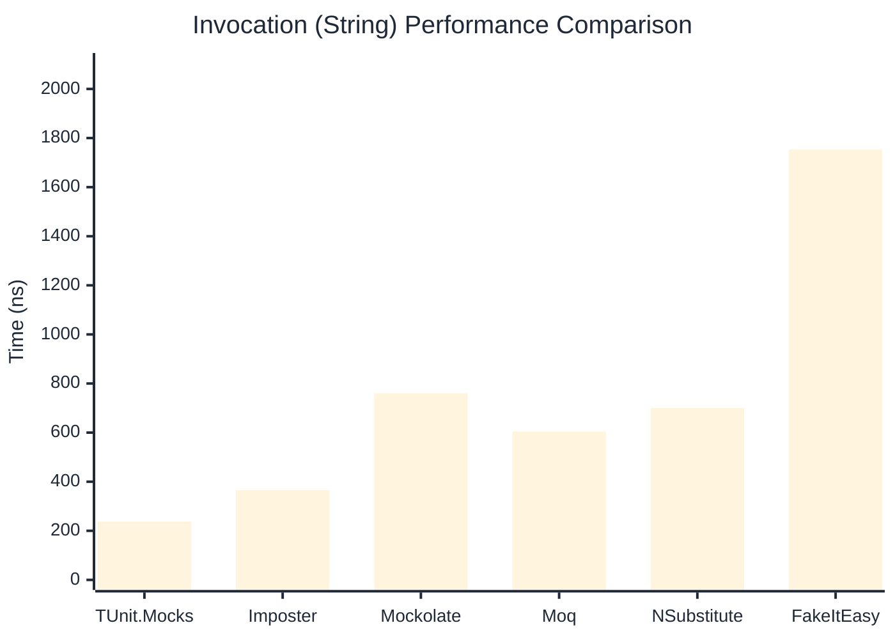
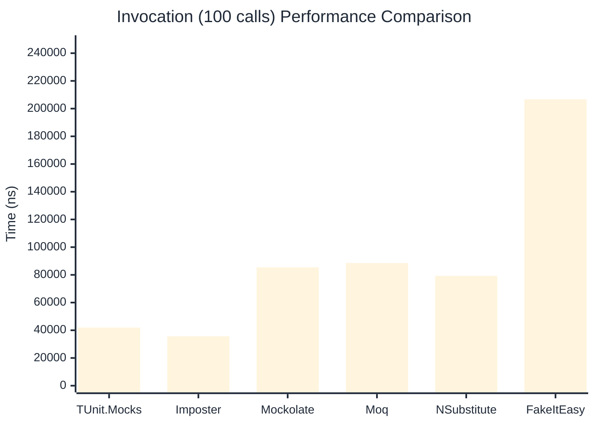

# Invocation Benchmark

:::info Last Updated
This benchmark was automatically generated on **2026-03-30** from the latest CI run.

**Environment:** Ubuntu Latest • .NET SDK 10.0.201
:::

## 📊 Results

Calling methods on mock objects:

| Library | Mean | Error | StdDev | Allocated |
|---------|------|-------|--------|-----------|
| **TUnit.Mocks** | 404.2 ns | 252.92 ns | 13.86 ns | 192 B |
| Imposter | 375.8 ns | 206.15 ns | 11.30 ns | 168 B |
| Mockolate | 872.2 ns | 163.84 ns | 8.98 ns | 688 B |
| Moq | 933.6 ns | 204.14 ns | 11.19 ns | 376 B |
| NSubstitute | 803.9 ns | 256.95 ns | 14.08 ns | 304 B |
| FakeItEasy | 2,058.4 ns | 501.26 ns | 27.48 ns | 944 B |

---

### String

| Library | Mean | Error | StdDev | Allocated |
|---------|------|-------|--------|-----------|
| **TUnit.Mocks** | 237.3 ns | 8.03 ns | 0.44 ns | 128 B |
| Imposter | 365.5 ns | 165.27 ns | 9.06 ns | 168 B |
| Mockolate | 760.2 ns | 293.25 ns | 16.07 ns | 568 B |
| Moq | 604.7 ns | 175.80 ns | 9.64 ns | 296 B |
| NSubstitute | 700.3 ns | 240.08 ns | 13.16 ns | 272 B |
| FakeItEasy | 1,754.0 ns | 440.00 ns | 24.12 ns | 776 B |

---

### 100 calls

| Library | Mean | Error | StdDev | Allocated |
|---------|------|-------|--------|-----------|
| **TUnit.Mocks** | 41,934.0 ns | 11,359.75 ns | 622.67 ns | 20096 B |
| Imposter | 35,631.0 ns | 7,181.18 ns | 393.62 ns | 16800 B |
| Mockolate | 85,371.9 ns | 22,839.30 ns | 1,251.90 ns | 68800 B |
| Moq | 88,551.5 ns | 40,570.95 ns | 2,223.83 ns | 37600 B |
| NSubstitute | 79,302.4 ns | 42,113.43 ns | 2,308.38 ns | 30848 B |
| FakeItEasy | 206,727.2 ns | 7,237.42 ns | 396.71 ns | 94400 B |

## 🎯 Key Insights

This benchmark compares **TUnit.Mocks** (source-generated) against runtime proxy-based mocking libraries for calling methods on mock objects.

---

:::note Methodology
View the [mock benchmarks overview](/docs/benchmarks/mocks) for methodology details and environment information.
:::

*Last generated: 2026-03-30T03:24:56.545Z*
