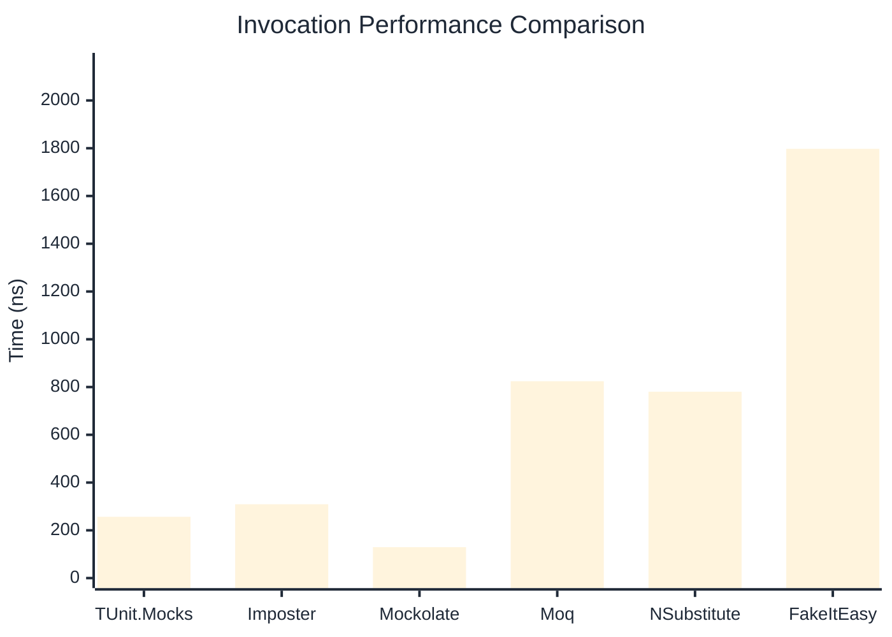

# Invocation Benchmark

:::info Last Updated
This benchmark was automatically generated on **2026-05-20** from the latest CI run.

**Environment:** Ubuntu Latest • .NET SDK 10.0.300
:::

## 📊 Results

Calling methods on mock objects:

| Library | Mean | Error | StdDev | Allocated |
|---------|------|-------|--------|-----------|
| **TUnit.Mocks** | 256.7 ns | 45.87 ns | 2.51 ns | 120 B |
| Imposter | 309.1 ns | 153.61 ns | 8.42 ns | 168 B |
| Mockolate | 129.5 ns | 50.18 ns | 2.75 ns | 84 B |
| Moq | 824.4 ns | 271.83 ns | 14.90 ns | 376 B |
| NSubstitute | 780.5 ns | 303.71 ns | 16.65 ns | 304 B |
| FakeItEasy | 1,797.5 ns | 899.47 ns | 49.30 ns | 944 B |

---

### String

| Library | Mean | Error | StdDev | Allocated |
|---------|------|-------|--------|-----------|
| **TUnit.Mocks** | 156.4 ns | 59.87 ns | 3.28 ns | 88 B |
| Imposter | 302.2 ns | 93.23 ns | 5.11 ns | 168 B |
| Mockolate | 100.9 ns | 26.99 ns | 1.48 ns | 60 B |
| Moq | 549.3 ns | 45.87 ns | 2.51 ns | 296 B |
| NSubstitute | 625.9 ns | 403.41 ns | 22.11 ns | 272 B |
| FakeItEasy | 1,564.0 ns | 15.32 ns | 0.84 ns | 776 B |

---

### 100 calls

| Library | Mean | Error | StdDev | Allocated |
|---------|------|-------|--------|-----------|
| **TUnit.Mocks** | 25,056.4 ns | 10,406.61 ns | 570.42 ns | 11936 B |
| Imposter | 29,579.1 ns | 11,225.62 ns | 615.31 ns | 16800 B |
| Mockolate | 10,672.0 ns | 889.70 ns | 48.77 ns | 8400 B |
| Moq | 80,233.4 ns | 16,322.90 ns | 894.71 ns | 37600 B |
| NSubstitute | 71,590.8 ns | 33,347.31 ns | 1,827.88 ns | 30848 B |
| FakeItEasy | 178,065.3 ns | 47,393.67 ns | 2,597.81 ns | 94400 B |

## 🎯 Key Insights

This benchmark compares **TUnit.Mocks** (source-generated) against runtime proxy-based mocking libraries for calling methods on mock objects.

---

:::note Methodology
View the [mock benchmarks overview](/docs/benchmarks/mocks) for methodology details and environment information.
:::

*Last generated: 2026-05-20T03:28:07.578Z*
