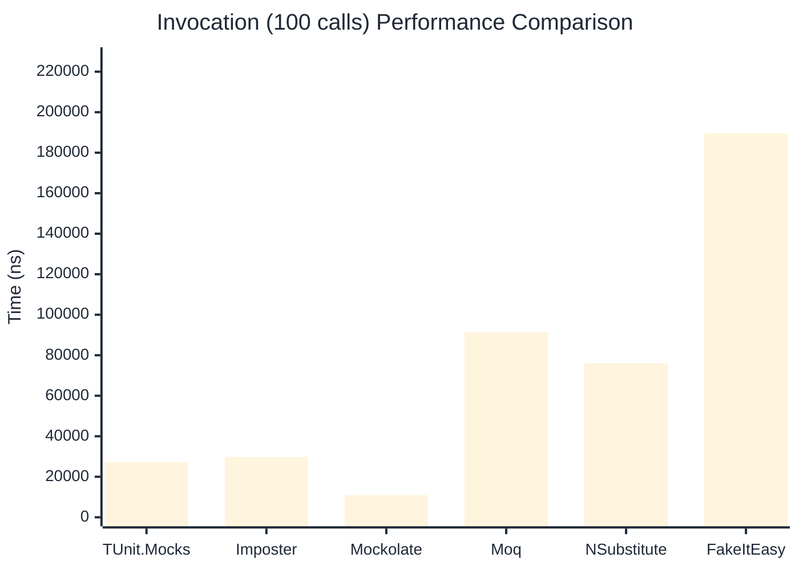

# Invocation Benchmark

> Calling methods on mock objects — comparing **TUnit.Mocks** (source-generated) against runtime proxy-based mocking libraries.

:::info Last Updated
This benchmark was automatically generated on **2026-06-16** from the latest CI run.

**Environment:** Ubuntu Latest • .NET SDK 10.0.301
:::

## 📊 Results

Calling methods on mock objects:

| Library | Mean | Error | StdDev | Allocated |
|---------|------|-------|--------|-----------|
| **TUnit.Mocks** | 280.3 ns | 97.63 ns | 5.35 ns | 128 B |
| Imposter | 299.7 ns | 107.32 ns | 5.88 ns | 168 B |
| Mockolate | 116.1 ns | 131.15 ns | 7.19 ns | 84 B |
| Moq | 857.5 ns | 212.29 ns | 11.64 ns | 376 B |
| NSubstitute | 764.2 ns | 210.56 ns | 11.54 ns | 304 B |
| FakeItEasy | 1,847.3 ns | 814.39 ns | 44.64 ns | 944 B |

---

### String

| Library | Mean | Error | StdDev | Allocated |
|---------|------|-------|--------|-----------|
| **TUnit.Mocks** | 166.8 ns | 63.40 ns | 3.48 ns | 96 B |
| Imposter | 296.0 ns | 116.11 ns | 6.36 ns | 168 B |
| Mockolate | 106.9 ns | 36.94 ns | 2.02 ns | 60 B |
| Moq | 577.3 ns | 201.13 ns | 11.02 ns | 296 B |
| NSubstitute | 679.0 ns | 246.35 ns | 13.50 ns | 328 B |
| FakeItEasy | 1,588.5 ns | 1,442.94 ns | 79.09 ns | 776 B |

---

### 100 calls

| Library | Mean | Error | StdDev | Allocated |
|---------|------|-------|--------|-----------|
| **TUnit.Mocks** | 27,273.6 ns | 12,452.58 ns | 682.57 ns | 12736 B |
| Imposter | 29,790.0 ns | 11,067.30 ns | 606.64 ns | 16800 B |
| Mockolate | 10,952.4 ns | 10,231.39 ns | 560.82 ns | 8400 B |
| Moq | 91,387.3 ns | 22,230.25 ns | 1,218.51 ns | 37600 B |
| NSubstitute | 76,035.4 ns | 10,932.13 ns | 599.23 ns | 30848 B |
| FakeItEasy | 189,643.3 ns | 112,559.24 ns | 6,169.75 ns | 94400 B |

## 🎯 Key Insights

This benchmark compares **TUnit.Mocks** (source-generated) against runtime proxy-based mocking libraries for calling methods on mock objects.

---

:::note Methodology
View the [mock benchmarks overview](/docs/benchmarks/mocks) for methodology details and environment information.
:::

*Last generated: 2026-06-16T03:29:20.737Z*
