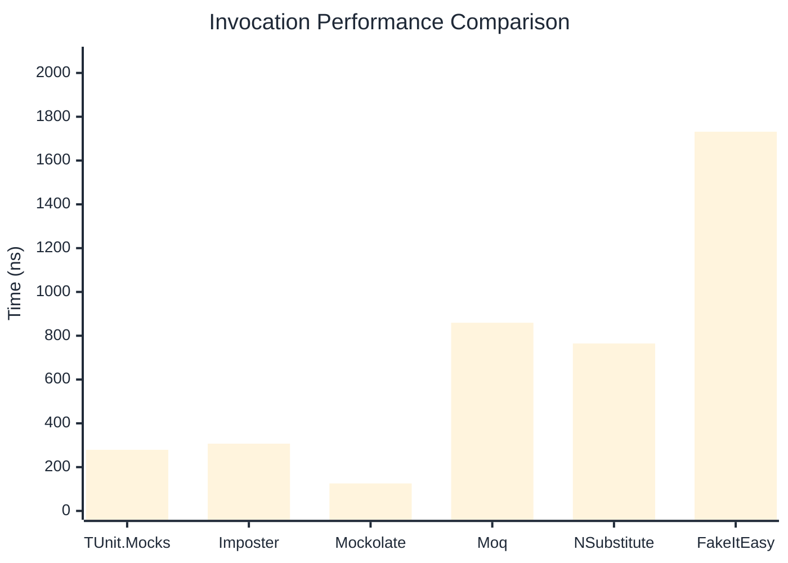

# Invocation Benchmark

> Calling methods on mock objects — comparing **TUnit.Mocks** (source-generated) against runtime proxy-based mocking libraries.

:::info Last Updated
This benchmark was automatically generated on **2026-06-30** from the latest CI run.

**Environment:** Ubuntu Latest • .NET SDK 10.0.301
:::

## 📊 Results

Calling methods on mock objects:

| Library | Mean | Error | StdDev | Allocated |
|---------|------|-------|--------|-----------|
| **TUnit.Mocks** | 279.1 ns | 99.62 ns | 5.46 ns | 128 B |
| Imposter | 307.1 ns | 63.49 ns | 3.48 ns | 168 B |
| Mockolate | 125.5 ns | 12.69 ns | 0.70 ns | 84 B |
| Moq | 859.3 ns | 147.55 ns | 8.09 ns | 376 B |
| NSubstitute | 764.5 ns | 108.57 ns | 5.95 ns | 304 B |
| FakeItEasy | 1,731.7 ns | 274.83 ns | 15.06 ns | 944 B |

---

### String

| Library | Mean | Error | StdDev | Allocated |
|---------|------|-------|--------|-----------|
| **TUnit.Mocks** | 174.1 ns | 58.63 ns | 3.21 ns | 96 B |
| Imposter | 302.1 ns | 64.56 ns | 3.54 ns | 168 B |
| Mockolate | 102.2 ns | 31.56 ns | 1.73 ns | 60 B |
| Moq | 538.7 ns | 216.49 ns | 11.87 ns | 296 B |
| NSubstitute | 612.0 ns | 242.80 ns | 13.31 ns | 272 B |
| FakeItEasy | 1,591.1 ns | 175.38 ns | 9.61 ns | 776 B |

---

### 100 calls

| Library | Mean | Error | StdDev | Allocated |
|---------|------|-------|--------|-----------|
| **TUnit.Mocks** | 26,847.9 ns | 10,420.96 ns | 571.21 ns | 12736 B |
| Imposter | 29,320.4 ns | 8,469.03 ns | 464.22 ns | 16800 B |
| Mockolate | 10,901.4 ns | 2,622.66 ns | 143.76 ns | 8400 B |
| Moq | 79,151.3 ns | 72,941.40 ns | 3,998.16 ns | 37600 B |
| NSubstitute | 78,610.8 ns | 183,805.36 ns | 10,074.99 ns | 30848 B |
| FakeItEasy | 177,020.2 ns | 49,184.95 ns | 2,695.99 ns | 94400 B |

## 🎯 Key Insights

This benchmark compares **TUnit.Mocks** (source-generated) against runtime proxy-based mocking libraries for calling methods on mock objects.

---

:::note Methodology
View the [mock benchmarks overview](/docs/benchmarks/mocks) for methodology details and environment information.
:::

*Last generated: 2026-06-30T03:28:32.223Z*
