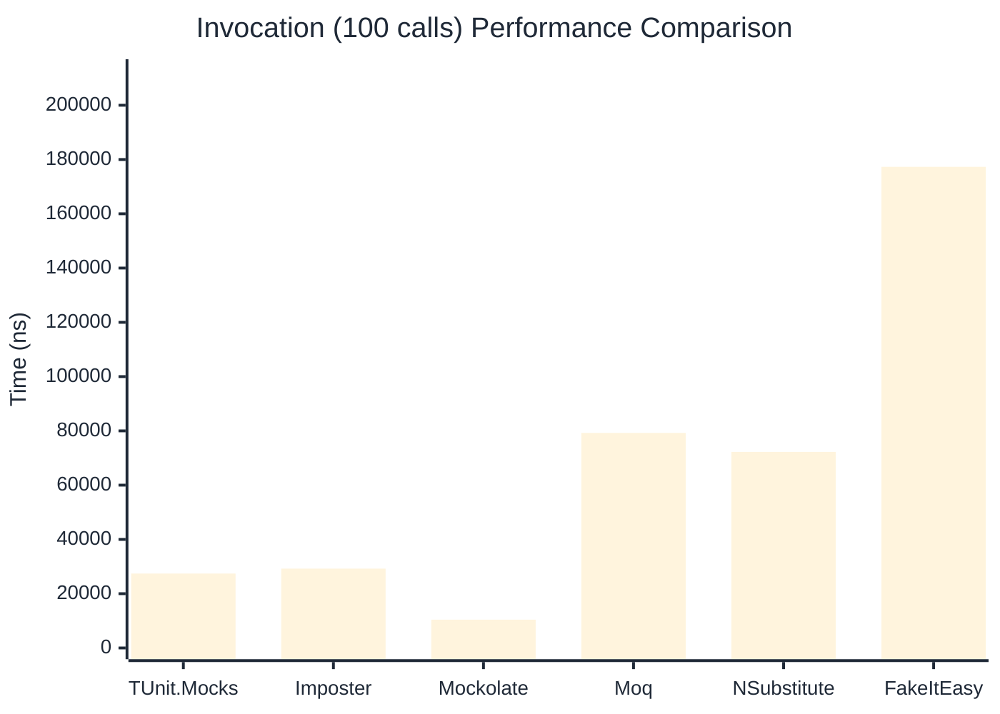

# Invocation Benchmark

> Calling methods on mock objects — comparing **TUnit.Mocks** (source-generated) against runtime proxy-based mocking libraries.

:::info Last Updated
This benchmark was automatically generated on **2026-07-10** from the latest CI run.

**Environment:** Ubuntu Latest • .NET SDK 10.0.301
:::

## 📊 Results

Calling methods on mock objects:

| Library | Mean | Error | StdDev | Allocated |
|---------|------|-------|--------|-----------|
| **TUnit.Mocks** | 273.62 ns | 102.47 ns | 5.617 ns | 128 B |
| Imposter | 299.97 ns | 119.81 ns | 6.567 ns | 168 B |
| Mockolate | 105.81 ns | 68.64 ns | 3.763 ns | 84 B |
| Moq | 806.71 ns | 361.59 ns | 19.820 ns | 376 B |
| NSubstitute | 731.47 ns | 103.49 ns | 5.673 ns | 304 B |
| FakeItEasy | 1,732.03 ns | 352.36 ns | 19.314 ns | 944 B |

---

### String

| Library | Mean | Error | StdDev | Allocated |
|---------|------|-------|--------|-----------|
| **TUnit.Mocks** | 167.06 ns | 88.01 ns | 4.824 ns | 96 B |
| Imposter | 294.46 ns | 78.84 ns | 4.322 ns | 168 B |
| Mockolate | 99.29 ns | 71.31 ns | 3.909 ns | 60 B |
| Moq | 527.60 ns | 178.50 ns | 9.784 ns | 296 B |
| NSubstitute | 645.97 ns | 229.72 ns | 12.592 ns | 328 B |
| FakeItEasy | 1,572.37 ns | 259.04 ns | 14.199 ns | 776 B |

---

### 100 calls

| Library | Mean | Error | StdDev | Allocated |
|---------|------|-------|--------|-----------|
| **TUnit.Mocks** | 27,414.27 ns | 13,261.82 ns | 726.925 ns | 12736 B |
| Imposter | 29,234.47 ns | 2,359.83 ns | 129.350 ns | 16800 B |
| Mockolate | 10,425.38 ns | 2,877.80 ns | 157.742 ns | 8400 B |
| Moq | 79,249.92 ns | 11,363.06 ns | 622.848 ns | 37600 B |
| NSubstitute | 72,252.67 ns | 19,302.31 ns | 1,058.025 ns | 30848 B |
| FakeItEasy | 177,308.90 ns | 53,522.10 ns | 2,933.727 ns | 94400 B |

## 🎯 Key Insights

This benchmark compares **TUnit.Mocks** (source-generated) against runtime proxy-based mocking libraries for calling methods on mock objects.

---

:::note Methodology
View the [mock benchmarks overview](/docs/benchmarks/mocks) for methodology details and environment information.
:::

*Last generated: 2026-07-10T03:24:43.056Z*
