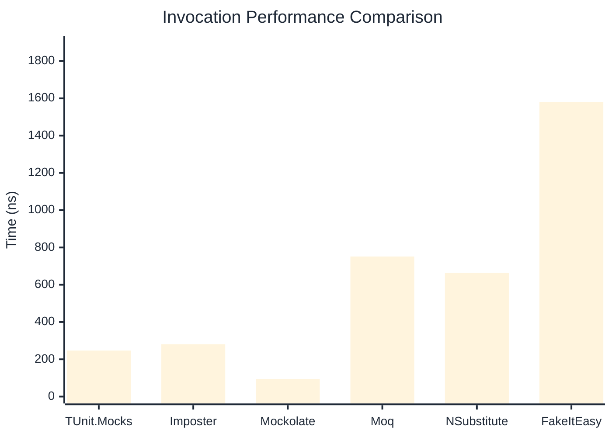

# Invocation Benchmark

:::info Last Updated
This benchmark was automatically generated on **2026-05-15** from the latest CI run.

**Environment:** Ubuntu Latest • .NET SDK 10.0.300
:::

## 📊 Results

Calling methods on mock objects:

| Library | Mean | Error | StdDev | Allocated |
|---------|------|-------|--------|-----------|
| **TUnit.Mocks** | 246.76 ns | 42.510 ns | 2.330 ns | 120 B |
| Imposter | 280.67 ns | 115.600 ns | 6.336 ns | 168 B |
| Mockolate | 94.58 ns | 3.811 ns | 0.209 ns | 84 B |
| Moq | 751.58 ns | 262.652 ns | 14.397 ns | 376 B |
| NSubstitute | 663.39 ns | 84.461 ns | 4.630 ns | 304 B |
| FakeItEasy | 1,579.88 ns | 250.137 ns | 13.711 ns | 944 B |

---

### String

| Library | Mean | Error | StdDev | Allocated |
|---------|------|-------|--------|-----------|
| **TUnit.Mocks** | 143.92 ns | 84.343 ns | 4.623 ns | 88 B |
| Imposter | 276.18 ns | 62.487 ns | 3.425 ns | 168 B |
| Mockolate | 86.59 ns | 15.620 ns | 0.856 ns | 60 B |
| Moq | 496.26 ns | 189.695 ns | 10.398 ns | 296 B |
| NSubstitute | 554.51 ns | 171.490 ns | 9.400 ns | 272 B |
| FakeItEasy | 1,440.96 ns | 179.695 ns | 9.850 ns | 776 B |

---

### 100 calls

| Library | Mean | Error | StdDev | Allocated |
|---------|------|-------|--------|-----------|
| **TUnit.Mocks** | 24,135.17 ns | 7,418.313 ns | 406.623 ns | 11936 B |
| Imposter | 26,597.38 ns | 6,974.438 ns | 382.292 ns | 16800 B |
| Mockolate | 9,475.17 ns | 3,637.234 ns | 199.369 ns | 8400 B |
| Moq | 75,449.56 ns | 18,088.406 ns | 991.487 ns | 37600 B |
| NSubstitute | 66,891.38 ns | 20,753.102 ns | 1,137.548 ns | 30848 B |
| FakeItEasy | 163,499.26 ns | 87,814.269 ns | 4,813.396 ns | 94400 B |

## 🎯 Key Insights

This benchmark compares **TUnit.Mocks** (source-generated) against runtime proxy-based mocking libraries for calling methods on mock objects.

---

:::note Methodology
View the [mock benchmarks overview](/docs/benchmarks/mocks) for methodology details and environment information.
:::

*Last generated: 2026-05-15T03:27:25.234Z*
