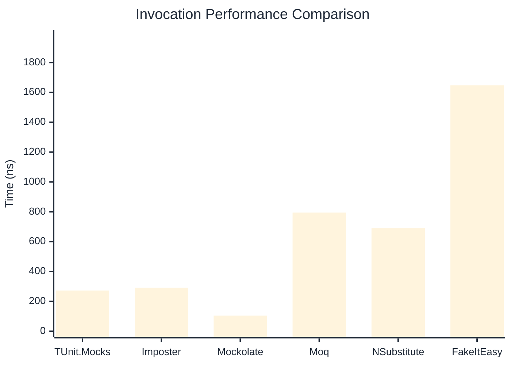

# Invocation Benchmark

> Calling methods on mock objects — comparing **TUnit.Mocks** (source-generated) against runtime proxy-based mocking libraries.

:::info Last Updated
This benchmark was automatically generated on **2026-06-25** from the latest CI run.

**Environment:** Ubuntu Latest • .NET SDK 10.0.301
:::

## 📊 Results

Calling methods on mock objects:

| Library | Mean | Error | StdDev | Allocated |
|---------|------|-------|--------|-----------|
| **TUnit.Mocks** | 272.74 ns | 129.07 ns | 7.075 ns | 128 B |
| Imposter | 291.41 ns | 74.40 ns | 4.078 ns | 168 B |
| Mockolate | 104.74 ns | 73.27 ns | 4.016 ns | 84 B |
| Moq | 794.67 ns | 246.58 ns | 13.516 ns | 376 B |
| NSubstitute | 690.28 ns | 116.80 ns | 6.402 ns | 304 B |
| FakeItEasy | 1,647.07 ns | 178.44 ns | 9.781 ns | 944 B |

---

### String

| Library | Mean | Error | StdDev | Allocated |
|---------|------|-------|--------|-----------|
| **TUnit.Mocks** | 165.12 ns | 64.99 ns | 3.562 ns | 96 B |
| Imposter | 284.66 ns | 87.48 ns | 4.795 ns | 168 B |
| Mockolate | 91.01 ns | 43.22 ns | 2.369 ns | 60 B |
| Moq | 509.75 ns | 145.22 ns | 7.960 ns | 296 B |
| NSubstitute | 593.75 ns | 188.70 ns | 10.343 ns | 272 B |
| FakeItEasy | 1,489.09 ns | 144.04 ns | 7.895 ns | 776 B |

---

### 100 calls

| Library | Mean | Error | StdDev | Allocated |
|---------|------|-------|--------|-----------|
| **TUnit.Mocks** | 26,483.30 ns | 7,124.11 ns | 390.496 ns | 12736 B |
| Imposter | 28,505.24 ns | 12,960.37 ns | 710.402 ns | 16800 B |
| Mockolate | 10,054.47 ns | 2,812.32 ns | 154.153 ns | 8400 B |
| Moq | 79,382.16 ns | 6,572.19 ns | 360.244 ns | 37600 B |
| NSubstitute | 70,175.73 ns | 11,203.78 ns | 614.117 ns | 30848 B |
| FakeItEasy | 168,617.38 ns | 65,833.89 ns | 3,608.578 ns | 94400 B |

## 🎯 Key Insights

This benchmark compares **TUnit.Mocks** (source-generated) against runtime proxy-based mocking libraries for calling methods on mock objects.

---

:::note Methodology
View the [mock benchmarks overview](/docs/benchmarks/mocks) for methodology details and environment information.
:::

*Last generated: 2026-06-25T03:27:42.911Z*
