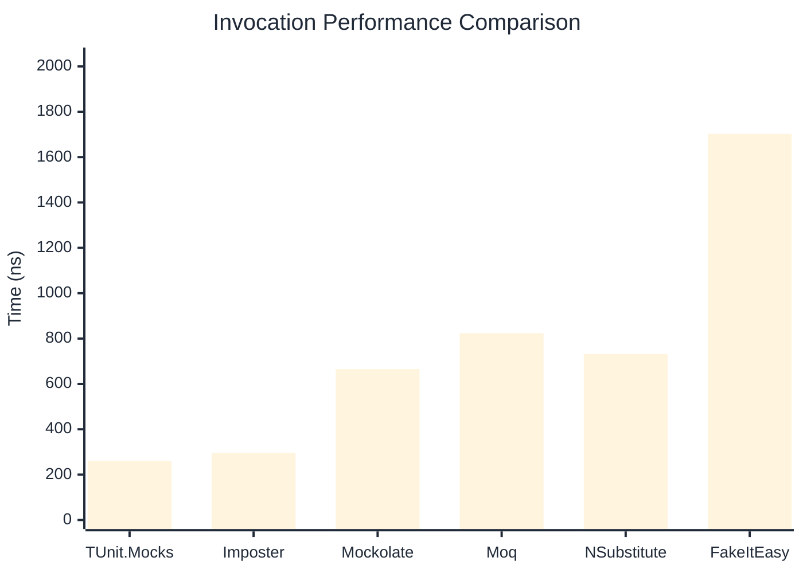
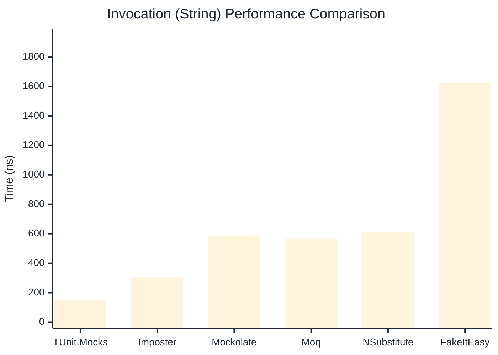

# Invocation Benchmark

:::info Last Updated
This benchmark was automatically generated on **2026-04-26** from the latest CI run.

**Environment:** Ubuntu Latest • .NET SDK 10.0.203
:::

## 📊 Results

Calling methods on mock objects:

| Library | Mean | Error | StdDev | Allocated |
|---------|------|-------|--------|-----------|
| **TUnit.Mocks** | 260.0 ns | 65.57 ns | 3.59 ns | 120 B |
| Imposter | 295.4 ns | 87.08 ns | 4.77 ns | 168 B |
| Mockolate | 665.8 ns | 150.33 ns | 8.24 ns | 640 B |
| Moq | 824.0 ns | 187.72 ns | 10.29 ns | 376 B |
| NSubstitute | 732.1 ns | 454.04 ns | 24.89 ns | 304 B |
| FakeItEasy | 1,702.5 ns | 809.67 ns | 44.38 ns | 944 B |

---

### String

| Library | Mean | Error | StdDev | Allocated |
|---------|------|-------|--------|-----------|
| **TUnit.Mocks** | 153.9 ns | 70.05 ns | 3.84 ns | 88 B |
| Imposter | 304.8 ns | 69.67 ns | 3.82 ns | 168 B |
| Mockolate | 588.0 ns | 131.98 ns | 7.23 ns | 520 B |
| Moq | 568.4 ns | 164.80 ns | 9.03 ns | 296 B |
| NSubstitute | 612.7 ns | 173.78 ns | 9.53 ns | 272 B |
| FakeItEasy | 1,624.6 ns | 211.69 ns | 11.60 ns | 776 B |

---

### 100 calls

| Library | Mean | Error | StdDev | Allocated |
|---------|------|-------|--------|-----------|
| **TUnit.Mocks** | 26,346.6 ns | 13,937.91 ns | 763.98 ns | 11936 B |
| Imposter | 30,049.5 ns | 9,092.34 ns | 498.38 ns | 16800 B |
| Mockolate | 81,052.1 ns | 40,577.62 ns | 2,224.20 ns | 64000 B |
| Moq | 89,027.3 ns | 19,760.40 ns | 1,083.13 ns | 37600 B |
| NSubstitute | 73,063.0 ns | 5,450.49 ns | 298.76 ns | 30848 B |
| FakeItEasy | 197,939.6 ns | 46,059.79 ns | 2,524.69 ns | 94400 B |

## 🎯 Key Insights

This benchmark compares **TUnit.Mocks** (source-generated) against runtime proxy-based mocking libraries for calling methods on mock objects.

---

:::note Methodology
View the [mock benchmarks overview](/docs/benchmarks/mocks) for methodology details and environment information.
:::

*Last generated: 2026-04-26T03:29:14.435Z*
