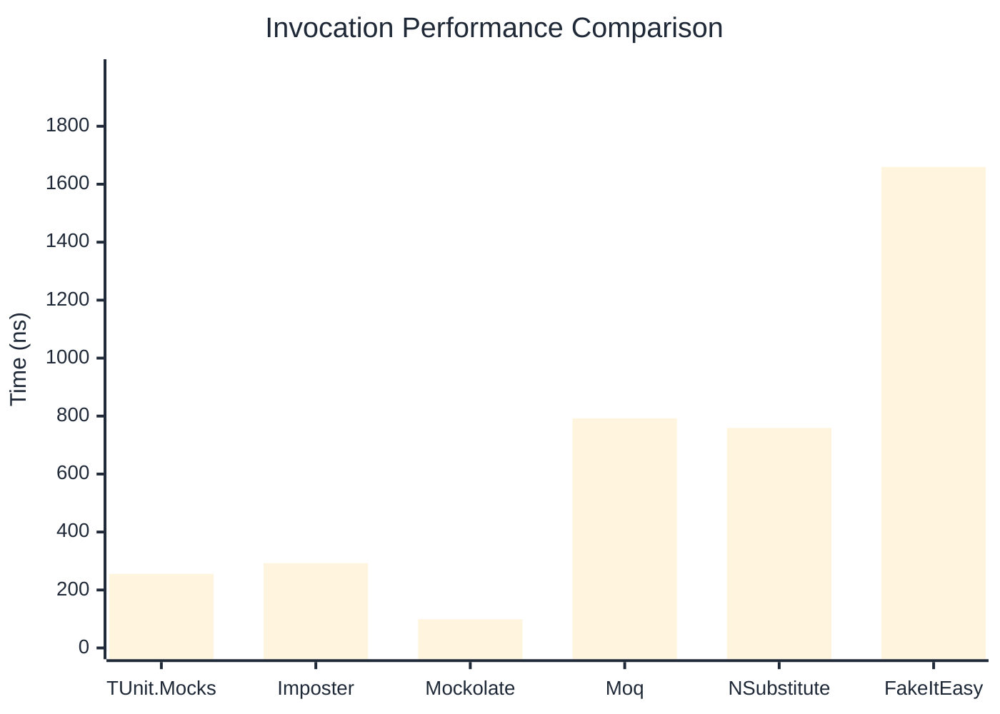
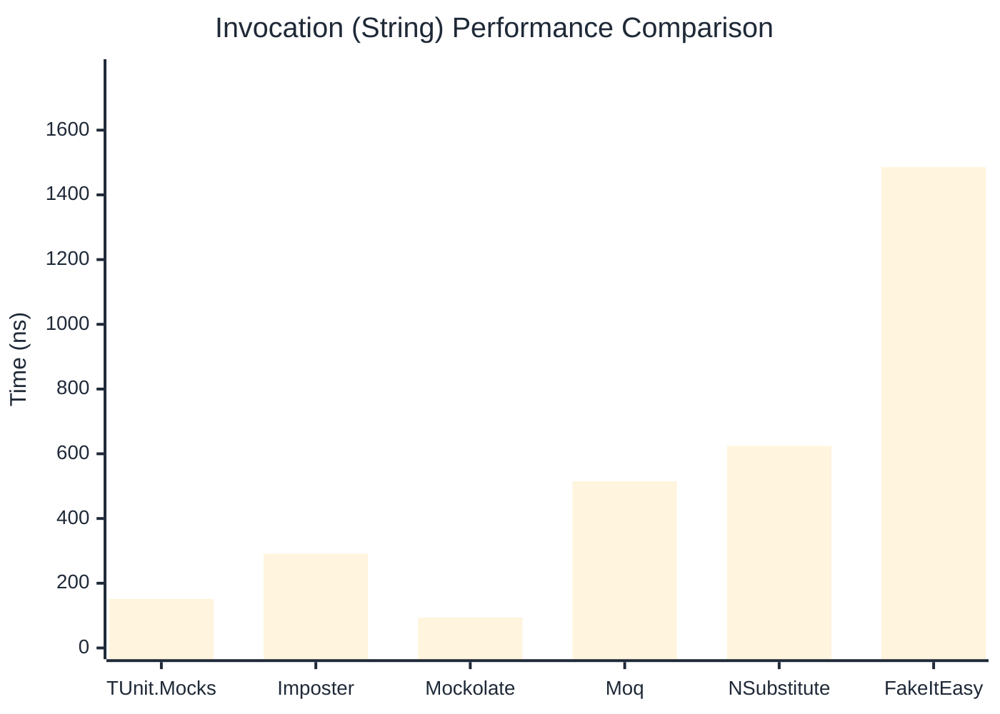

# Invocation Benchmark

:::info Last Updated
This benchmark was automatically generated on **2026-05-18** from the latest CI run.

**Environment:** Ubuntu Latest • .NET SDK 10.0.300
:::

## 📊 Results

Calling methods on mock objects:

| Library | Mean | Error | StdDev | Allocated |
|---------|------|-------|--------|-----------|
| **TUnit.Mocks** | 255.66 ns | 50.888 ns | 2.789 ns | 120 B |
| Imposter | 292.65 ns | 95.004 ns | 5.208 ns | 168 B |
| Mockolate | 98.90 ns | 9.432 ns | 0.517 ns | 84 B |
| Moq | 792.14 ns | 97.081 ns | 5.321 ns | 376 B |
| NSubstitute | 759.23 ns | 284.626 ns | 15.601 ns | 360 B |
| FakeItEasy | 1,659.69 ns | 148.704 ns | 8.151 ns | 944 B |

---

### String

| Library | Mean | Error | StdDev | Allocated |
|---------|------|-------|--------|-----------|
| **TUnit.Mocks** | 151.62 ns | 67.067 ns | 3.676 ns | 88 B |
| Imposter | 291.29 ns | 65.330 ns | 3.581 ns | 168 B |
| Mockolate | 93.64 ns | 35.119 ns | 1.925 ns | 60 B |
| Moq | 514.88 ns | 83.119 ns | 4.556 ns | 296 B |
| NSubstitute | 624.13 ns | 75.636 ns | 4.146 ns | 328 B |
| FakeItEasy | 1,486.10 ns | 109.268 ns | 5.989 ns | 776 B |

---

### 100 calls

| Library | Mean | Error | StdDev | Allocated |
|---------|------|-------|--------|-----------|
| **TUnit.Mocks** | 25,740.87 ns | 10,477.861 ns | 574.327 ns | 11936 B |
| Imposter | 28,404.96 ns | 3,657.442 ns | 200.477 ns | 16800 B |
| Mockolate | 9,831.15 ns | 1,669.614 ns | 91.517 ns | 8400 B |
| Moq | 77,229.62 ns | 8,028.239 ns | 440.055 ns | 37600 B |
| NSubstitute | 67,921.86 ns | 7,682.708 ns | 421.115 ns | 30848 B |
| FakeItEasy | 173,055.26 ns | 94,892.964 ns | 5,201.404 ns | 94400 B |

## 🎯 Key Insights

This benchmark compares **TUnit.Mocks** (source-generated) against runtime proxy-based mocking libraries for calling methods on mock objects.

---

:::note Methodology
View the [mock benchmarks overview](/docs/benchmarks/mocks) for methodology details and environment information.
:::

*Last generated: 2026-05-18T03:29:10.052Z*
