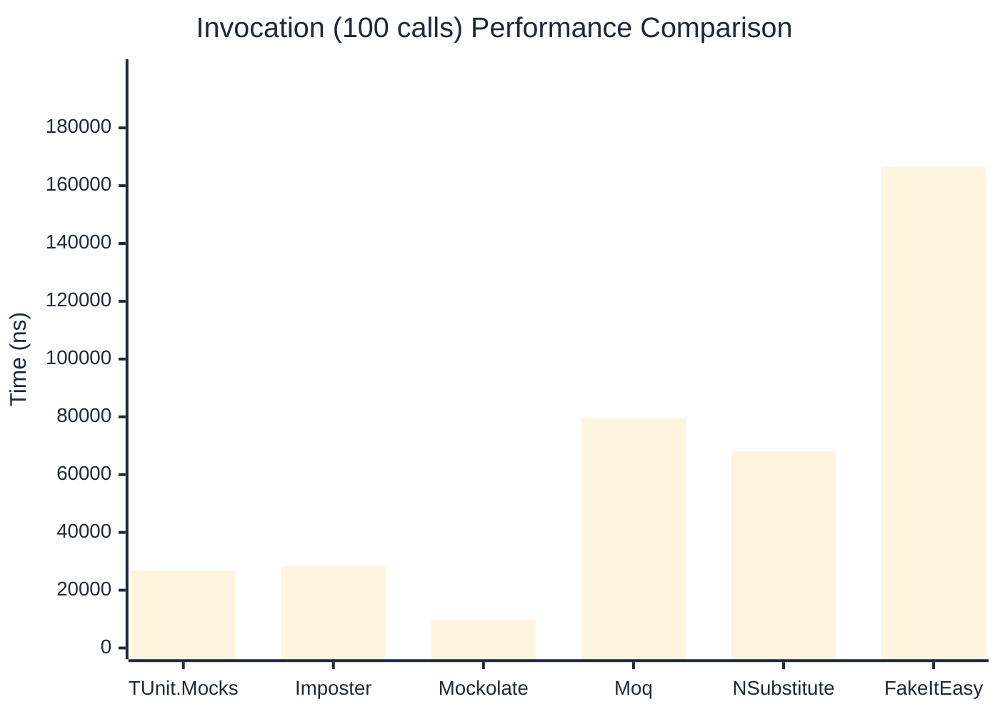

# Invocation Benchmark

> Calling methods on mock objects — comparing **TUnit.Mocks** (source-generated) against runtime proxy-based mocking libraries.

:::info Last Updated
This benchmark was automatically generated on **2026-07-18** from the latest CI run.

**Environment:** Ubuntu Latest • .NET SDK 10.0.302
:::

## 📊 Results

Calling methods on mock objects:

| Library | Mean | Error | StdDev | Allocated |
|---------|------|-------|--------|-----------|
| **TUnit.Mocks** | 268.82 ns | 94.050 ns | 5.155 ns | 128 B |
| Imposter | 289.23 ns | 72.458 ns | 3.972 ns | 168 B |
| Mockolate | 97.23 ns | 8.163 ns | 0.447 ns | 84 B |
| Moq | 779.18 ns | 102.106 ns | 5.597 ns | 376 B |
| NSubstitute | 687.43 ns | 84.433 ns | 4.628 ns | 304 B |
| FakeItEasy | 1,646.50 ns | 171.102 ns | 9.379 ns | 944 B |

---

### String

| Library | Mean | Error | StdDev | Allocated |
|---------|------|-------|--------|-----------|
| **TUnit.Mocks** | 164.49 ns | 77.738 ns | 4.261 ns | 96 B |
| Imposter | 289.85 ns | 91.629 ns | 5.023 ns | 168 B |
| Mockolate | 91.17 ns | 3.098 ns | 0.170 ns | 60 B |
| Moq | 512.51 ns | 50.686 ns | 2.778 ns | 296 B |
| NSubstitute | 588.63 ns | 217.284 ns | 11.910 ns | 272 B |
| FakeItEasy | 1,481.92 ns | 165.295 ns | 9.060 ns | 776 B |

---

### 100 calls

| Library | Mean | Error | StdDev | Allocated |
|---------|------|-------|--------|-----------|
| **TUnit.Mocks** | 26,660.50 ns | 12,290.566 ns | 673.687 ns | 12736 B |
| Imposter | 28,408.06 ns | 6,953.330 ns | 381.136 ns | 16800 B |
| Mockolate | 9,741.00 ns | 2,523.004 ns | 138.294 ns | 8400 B |
| Moq | 79,583.09 ns | 24,667.273 ns | 1,352.096 ns | 37600 B |
| NSubstitute | 67,980.85 ns | 21,638.056 ns | 1,186.055 ns | 30848 B |
| FakeItEasy | 166,533.82 ns | 67,417.348 ns | 3,695.372 ns | 94400 B |

## 🎯 Key Insights

This benchmark compares **TUnit.Mocks** (source-generated) against runtime proxy-based mocking libraries for calling methods on mock objects.

---

:::note Methodology
View the [mock benchmarks overview](/docs/benchmarks/mocks) for methodology details and environment information.
:::

*Last generated: 2026-07-18T03:20:37.479Z*
