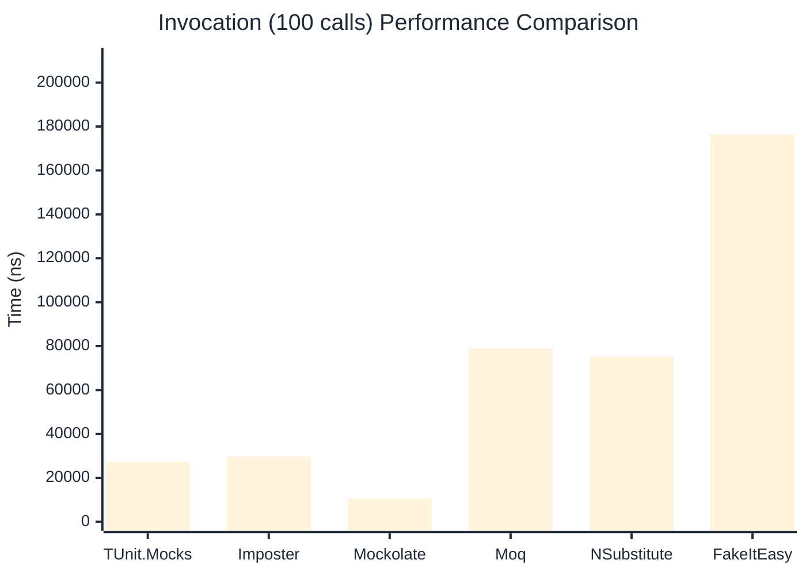

# Invocation Benchmark

> Calling methods on mock objects — comparing **TUnit.Mocks** (source-generated) against runtime proxy-based mocking libraries.

:::info Last Updated
This benchmark was automatically generated on **2026-07-16** from the latest CI run.

**Environment:** Ubuntu Latest • .NET SDK 10.0.302
:::

## 📊 Results

Calling methods on mock objects:

| Library | Mean | Error | StdDev | Allocated |
|---------|------|-------|--------|-----------|
| **TUnit.Mocks** | 281.48 ns | 79.32 ns | 4.348 ns | 128 B |
| Imposter | 299.91 ns | 60.08 ns | 3.293 ns | 168 B |
| Mockolate | 107.51 ns | 20.59 ns | 1.129 ns | 84 B |
| Moq | 799.88 ns | 81.14 ns | 4.448 ns | 376 B |
| NSubstitute | 731.28 ns | 73.30 ns | 4.018 ns | 304 B |
| FakeItEasy | 1,735.17 ns | 354.64 ns | 19.439 ns | 944 B |

---

### String

| Library | Mean | Error | StdDev | Allocated |
|---------|------|-------|--------|-----------|
| **TUnit.Mocks** | 174.93 ns | 71.18 ns | 3.902 ns | 96 B |
| Imposter | 302.20 ns | 100.49 ns | 5.508 ns | 168 B |
| Mockolate | 97.57 ns | 11.39 ns | 0.624 ns | 60 B |
| Moq | 543.42 ns | 47.08 ns | 2.580 ns | 296 B |
| NSubstitute | 598.20 ns | 161.76 ns | 8.867 ns | 272 B |
| FakeItEasy | 1,560.51 ns | 151.59 ns | 8.309 ns | 776 B |

---

### 100 calls

| Library | Mean | Error | StdDev | Allocated |
|---------|------|-------|--------|-----------|
| **TUnit.Mocks** | 27,313.01 ns | 13,098.03 ns | 717.947 ns | 12736 B |
| Imposter | 29,713.79 ns | 7,045.81 ns | 386.205 ns | 16800 B |
| Mockolate | 10,720.10 ns | 3,209.51 ns | 175.924 ns | 8400 B |
| Moq | 78,900.23 ns | 18,990.50 ns | 1,040.933 ns | 37600 B |
| NSubstitute | 75,178.99 ns | 10,934.37 ns | 599.350 ns | 36448 B |
| FakeItEasy | 176,434.93 ns | 74,355.66 ns | 4,075.685 ns | 94400 B |

## 🎯 Key Insights

This benchmark compares **TUnit.Mocks** (source-generated) against runtime proxy-based mocking libraries for calling methods on mock objects.

---

:::note Methodology
View the [mock benchmarks overview](/docs/benchmarks/mocks) for methodology details and environment information.
:::

*Last generated: 2026-07-16T03:22:07.543Z*
