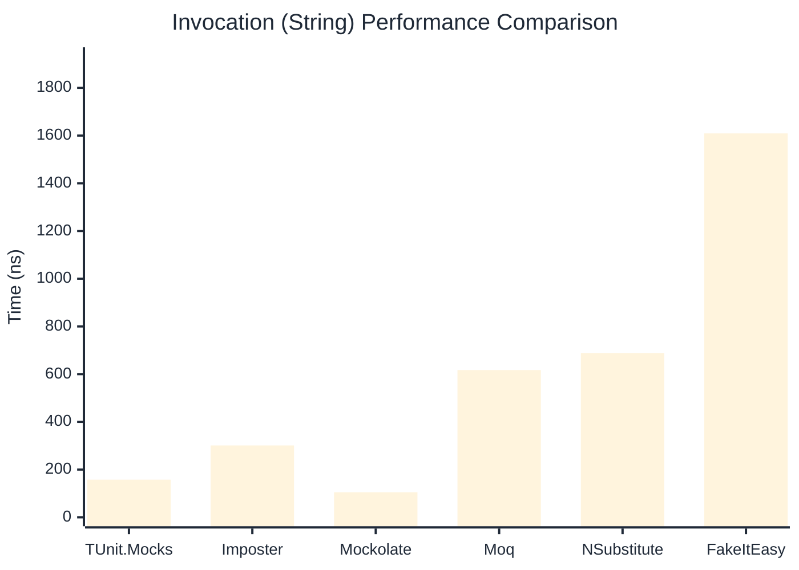

# Invocation Benchmark

:::info Last Updated
This benchmark was automatically generated on **2026-06-01** from the latest CI run.

**Environment:** Ubuntu Latest • .NET SDK 10.0.300
:::

## 📊 Results

Calling methods on mock objects:

| Library | Mean | Error | StdDev | Allocated |
|---------|------|-------|--------|-----------|
| **TUnit.Mocks** | 260.4 ns | 64.29 ns | 3.52 ns | 120 B |
| Imposter | 311.4 ns | 37.26 ns | 2.04 ns | 168 B |
| Mockolate | 120.5 ns | 7.69 ns | 0.42 ns | 84 B |
| Moq | 819.8 ns | 396.19 ns | 21.72 ns | 376 B |
| NSubstitute | 725.5 ns | 67.09 ns | 3.68 ns | 304 B |
| FakeItEasy | 1,827.4 ns | 1,152.43 ns | 63.17 ns | 944 B |

---

### String

| Library | Mean | Error | StdDev | Allocated |
|---------|------|-------|--------|-----------|
| **TUnit.Mocks** | 157.5 ns | 79.71 ns | 4.37 ns | 88 B |
| Imposter | 301.1 ns | 61.36 ns | 3.36 ns | 168 B |
| Mockolate | 105.0 ns | 32.50 ns | 1.78 ns | 60 B |
| Moq | 617.1 ns | 70.98 ns | 3.89 ns | 296 B |
| NSubstitute | 688.6 ns | 318.67 ns | 17.47 ns | 272 B |
| FakeItEasy | 1,609.2 ns | 408.98 ns | 22.42 ns | 776 B |

---

### 100 calls

| Library | Mean | Error | StdDev | Allocated |
|---------|------|-------|--------|-----------|
| **TUnit.Mocks** | 26,678.6 ns | 11,968.79 ns | 656.05 ns | 11936 B |
| Imposter | 28,757.4 ns | 7,657.55 ns | 419.74 ns | 16800 B |
| Mockolate | 11,308.8 ns | 11,005.13 ns | 603.23 ns | 8400 B |
| Moq | 84,864.0 ns | 20,776.19 ns | 1,138.81 ns | 37600 B |
| NSubstitute | 71,655.5 ns | 24,233.38 ns | 1,328.31 ns | 30848 B |
| FakeItEasy | 176,945.0 ns | 187,627.61 ns | 10,284.50 ns | 94400 B |

## 🎯 Key Insights

This benchmark compares **TUnit.Mocks** (source-generated) against runtime proxy-based mocking libraries for calling methods on mock objects.

---

:::note Methodology
View the [mock benchmarks overview](/docs/benchmarks/mocks) for methodology details and environment information.
:::

*Last generated: 2026-06-01T03:31:09.013Z*
