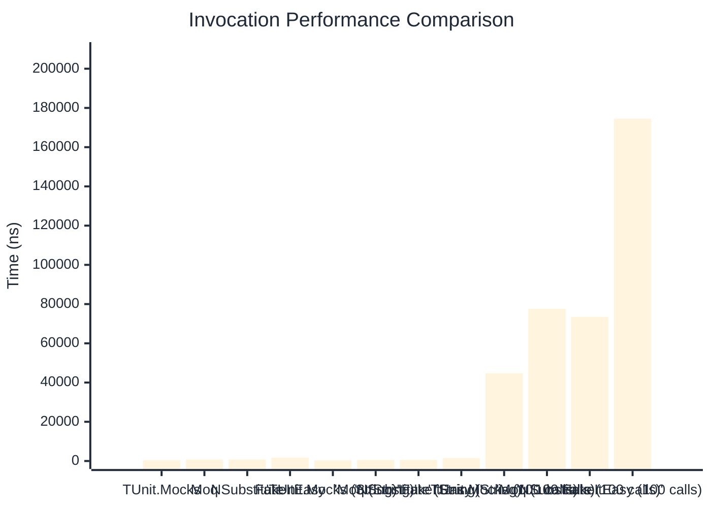

# Invocation Benchmark

:::info Last Updated
This benchmark was automatically generated on **2026-03-28** from the latest CI run.

**Environment:** Ubuntu Latest • .NET SDK 10.0.201
:::

## 📊 Results

Calling methods on mock objects:

| Method | Mean | Error | StdDev | Allocated |
|--------|------|-------|--------|-----------|
| **TUnit.Mocks** | 454.5 ns | 107.54 ns | 5.89 ns | 224 B |
| Moq | 773.6 ns | 144.04 ns | 7.90 ns | 376 B |
| NSubstitute | 751.4 ns | 485.33 ns | 26.60 ns | 304 B |
| FakeItEasy | 1,683.0 ns | 257.66 ns | 14.12 ns | 944 B |
| **'TUnit.Mocks (String)'** | 314.2 ns | 86.13 ns | 4.72 ns | 160 B |
| 'Moq (String)' | 538.5 ns | 457.42 ns | 25.07 ns | 296 B |
| 'NSubstitute (String)' | 587.4 ns | 73.87 ns | 4.05 ns | 272 B |
| 'FakeItEasy (String)' | 1,476.6 ns | 245.43 ns | 13.45 ns | 776 B |
| **'TUnit.Mocks (100 calls)'** | 44,747.7 ns | 19,324.27 ns | 1,059.23 ns | 23296 B |
| 'Moq (100 calls)' | 77,566.7 ns | 25,798.33 ns | 1,414.09 ns | 37600 B |
| 'NSubstitute (100 calls)' | 73,504.2 ns | 22,769.43 ns | 1,248.07 ns | 36448 B |
| 'FakeItEasy (100 calls)' | 174,519.1 ns | 67,899.40 ns | 3,721.80 ns | 94400 B |

## 📈 Visual Comparison

## 🎯 Key Insights

This benchmark compares **TUnit.Mocks** (source-generated) against runtime proxy-based mocking libraries for calling methods on mock objects.

---

:::note Methodology
View the [mock benchmarks overview](/docs/benchmarks/mocks) for methodology details and environment information.
:::

*Last generated: 2026-03-28T22:34:52.303Z*
