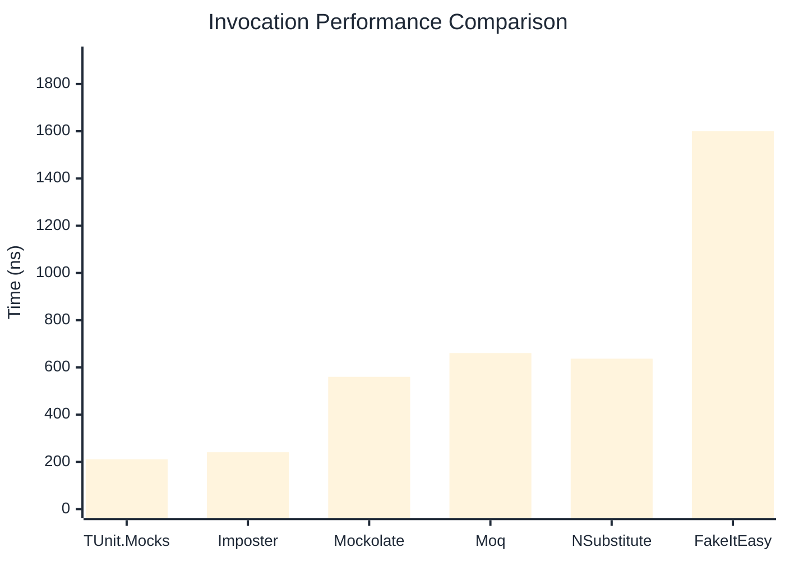
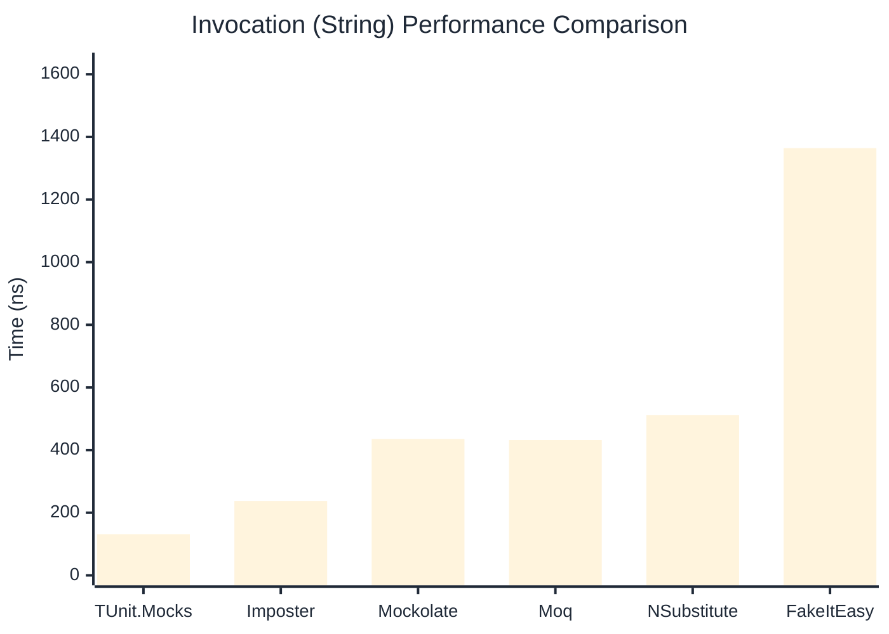

# Invocation Benchmark

:::info Last Updated
This benchmark was automatically generated on **2026-04-20** from the latest CI run.

**Environment:** Ubuntu Latest • .NET SDK 10.0.202
:::

## 📊 Results

Calling methods on mock objects:

| Library | Mean | Error | StdDev | Allocated |
|---------|------|-------|--------|-----------|
| **TUnit.Mocks** | 211.1 ns | 62.33 ns | 3.42 ns | 120 B |
| Imposter | 240.8 ns | 51.60 ns | 2.83 ns | 168 B |
| Mockolate | 560.2 ns | 452.94 ns | 24.83 ns | 640 B |
| Moq | 660.9 ns | 139.69 ns | 7.66 ns | 376 B |
| NSubstitute | 636.9 ns | 291.88 ns | 16.00 ns | 304 B |
| FakeItEasy | 1,600.5 ns | 2,298.57 ns | 125.99 ns | 944 B |

---

### String

| Library | Mean | Error | StdDev | Allocated |
|---------|------|-------|--------|-----------|
| **TUnit.Mocks** | 131.5 ns | 57.64 ns | 3.16 ns | 88 B |
| Imposter | 237.6 ns | 24.32 ns | 1.33 ns | 168 B |
| Mockolate | 435.6 ns | 122.65 ns | 6.72 ns | 520 B |
| Moq | 432.2 ns | 152.68 ns | 8.37 ns | 296 B |
| NSubstitute | 511.4 ns | 326.44 ns | 17.89 ns | 272 B |
| FakeItEasy | 1,364.1 ns | 926.68 ns | 50.79 ns | 776 B |

---

### 100 calls

| Library | Mean | Error | StdDev | Allocated |
|---------|------|-------|--------|-----------|
| **TUnit.Mocks** | 21,128.7 ns | 10,260.75 ns | 562.43 ns | 11936 B |
| Imposter | 23,614.7 ns | 3,072.79 ns | 168.43 ns | 16800 B |
| Mockolate | 55,636.6 ns | 41,369.78 ns | 2,267.62 ns | 64000 B |
| Moq | 61,691.8 ns | 24,735.69 ns | 1,355.85 ns | 37600 B |
| NSubstitute | 59,428.5 ns | 22,747.38 ns | 1,246.86 ns | 30848 B |
| FakeItEasy | 142,848.5 ns | 68,578.71 ns | 3,759.03 ns | 94400 B |

## 🎯 Key Insights

This benchmark compares **TUnit.Mocks** (source-generated) against runtime proxy-based mocking libraries for calling methods on mock objects.

---

:::note Methodology
View the [mock benchmarks overview](/docs/benchmarks/mocks) for methodology details and environment information.
:::

*Last generated: 2026-04-20T03:23:48.728Z*
