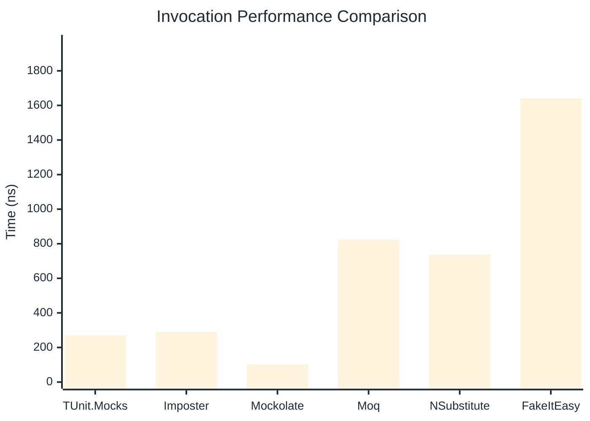

# Invocation Benchmark

> Calling methods on mock objects — comparing **TUnit.Mocks** (source-generated) against runtime proxy-based mocking libraries.

:::info Last Updated
This benchmark was automatically generated on **2026-07-08** from the latest CI run.

**Environment:** Ubuntu Latest • .NET SDK 10.0.301
:::

## 📊 Results

Calling methods on mock objects:

| Library | Mean | Error | StdDev | Allocated |
|---------|------|-------|--------|-----------|
| **TUnit.Mocks** | 270.39 ns | 74.145 ns | 4.064 ns | 128 B |
| Imposter | 288.53 ns | 67.643 ns | 3.708 ns | 168 B |
| Mockolate | 101.63 ns | 8.745 ns | 0.479 ns | 84 B |
| Moq | 824.92 ns | 331.161 ns | 18.152 ns | 376 B |
| NSubstitute | 736.40 ns | 329.798 ns | 18.077 ns | 304 B |
| FakeItEasy | 1,640.64 ns | 612.249 ns | 33.559 ns | 944 B |

---

### String

| Library | Mean | Error | StdDev | Allocated |
|---------|------|-------|--------|-----------|
| **TUnit.Mocks** | 164.26 ns | 68.934 ns | 3.779 ns | 96 B |
| Imposter | 291.19 ns | 129.437 ns | 7.095 ns | 168 B |
| Mockolate | 96.95 ns | 41.849 ns | 2.294 ns | 60 B |
| Moq | 543.18 ns | 174.171 ns | 9.547 ns | 296 B |
| NSubstitute | 626.51 ns | 260.514 ns | 14.280 ns | 272 B |
| FakeItEasy | 1,601.87 ns | 582.682 ns | 31.939 ns | 776 B |

---

### 100 calls

| Library | Mean | Error | StdDev | Allocated |
|---------|------|-------|--------|-----------|
| **TUnit.Mocks** | 27,198.61 ns | 6,831.635 ns | 374.465 ns | 12736 B |
| Imposter | 28,305.03 ns | 9,812.652 ns | 537.865 ns | 16800 B |
| Mockolate | 10,420.54 ns | 4,498.604 ns | 246.584 ns | 8400 B |
| Moq | 79,977.98 ns | 19,955.648 ns | 1,093.836 ns | 37600 B |
| NSubstitute | 70,758.59 ns | 30,770.533 ns | 1,686.637 ns | 30848 B |
| FakeItEasy | 176,213.89 ns | 43,976.386 ns | 2,410.494 ns | 94400 B |

## 🎯 Key Insights

This benchmark compares **TUnit.Mocks** (source-generated) against runtime proxy-based mocking libraries for calling methods on mock objects.

---

:::note Methodology
View the [mock benchmarks overview](/docs/benchmarks/mocks) for methodology details and environment information.
:::

*Last generated: 2026-07-08T03:21:22.090Z*
