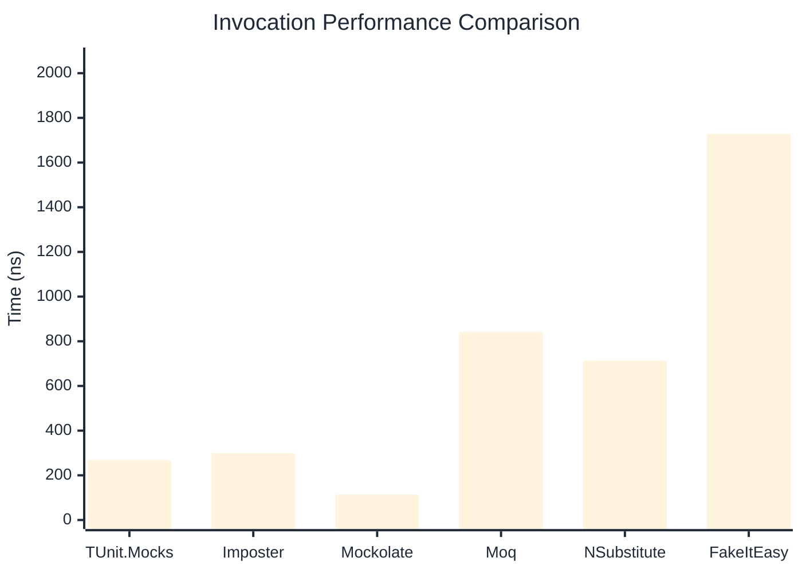

# Invocation Benchmark

> Calling methods on mock objects — comparing **TUnit.Mocks** (source-generated) against runtime proxy-based mocking libraries.

:::info Last Updated
This benchmark was automatically generated on **2026-07-24** from the latest CI run.

**Environment:** Ubuntu Latest • .NET SDK 10.0.302
:::

## 📊 Results

Calling methods on mock objects:

| Library | Mean | Error | StdDev | Allocated |
|---------|------|-------|--------|-----------|
| **TUnit.Mocks** | 268.1 ns | 74.80 ns | 4.10 ns | 128 B |
| Imposter | 298.8 ns | 98.02 ns | 5.37 ns | 168 B |
| Mockolate | 113.3 ns | 184.81 ns | 10.13 ns | 84 B |
| Moq | 841.8 ns | 447.97 ns | 24.55 ns | 376 B |
| NSubstitute | 712.7 ns | 188.37 ns | 10.33 ns | 304 B |
| FakeItEasy | 1,728.1 ns | 210.96 ns | 11.56 ns | 944 B |

---

### String

| Library | Mean | Error | StdDev | Allocated |
|---------|------|-------|--------|-----------|
| **TUnit.Mocks** | 165.8 ns | 77.82 ns | 4.27 ns | 96 B |
| Imposter | 303.7 ns | 106.26 ns | 5.82 ns | 168 B |
| Mockolate | 105.8 ns | 53.57 ns | 2.94 ns | 60 B |
| Moq | 543.8 ns | 138.28 ns | 7.58 ns | 296 B |
| NSubstitute | 597.1 ns | 146.47 ns | 8.03 ns | 272 B |
| FakeItEasy | 1,504.0 ns | 47.78 ns | 2.62 ns | 776 B |

---

### 100 calls

| Library | Mean | Error | StdDev | Allocated |
|---------|------|-------|--------|-----------|
| **TUnit.Mocks** | 26,937.4 ns | 12,290.43 ns | 673.68 ns | 12736 B |
| Imposter | 28,526.3 ns | 7,106.98 ns | 389.56 ns | 16800 B |
| Mockolate | 9,876.2 ns | 5,521.87 ns | 302.67 ns | 8400 B |
| Moq | 79,740.0 ns | 15,882.08 ns | 870.55 ns | 37600 B |
| NSubstitute | 68,668.0 ns | 8,620.28 ns | 472.51 ns | 30848 B |
| FakeItEasy | 168,859.3 ns | 22,434.50 ns | 1,229.71 ns | 94400 B |

## 🎯 Key Insights

This benchmark compares **TUnit.Mocks** (source-generated) against runtime proxy-based mocking libraries for calling methods on mock objects.

---

:::note Methodology
View the [mock benchmarks overview](/docs/benchmarks/mocks) for methodology details and environment information.
:::

*Last generated: 2026-07-24T03:21:14.704Z*
