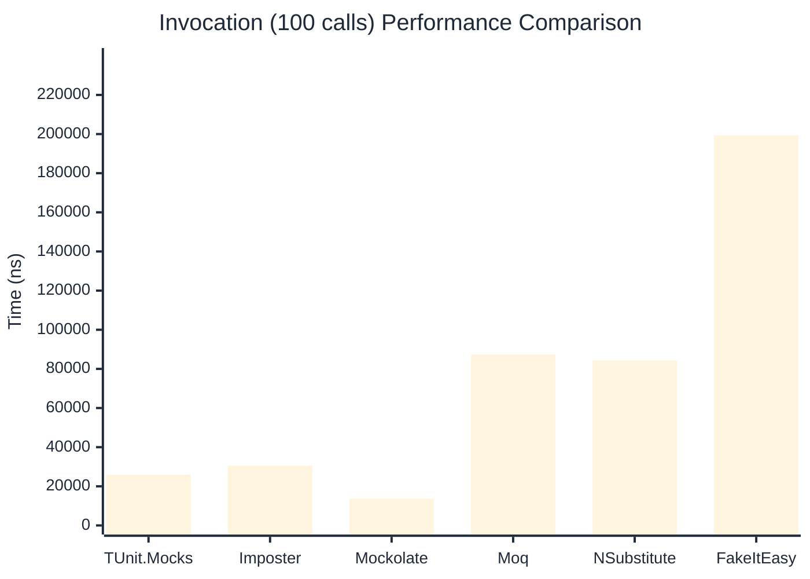

# Invocation Benchmark

:::info Last Updated
This benchmark was automatically generated on **2026-05-17** from the latest CI run.

**Environment:** Ubuntu Latest • .NET SDK 10.0.300
:::

## 📊 Results

Calling methods on mock objects:

| Library | Mean | Error | StdDev | Allocated |
|---------|------|-------|--------|-----------|
| **TUnit.Mocks** | 258.2 ns | 57.15 ns | 3.13 ns | 120 B |
| Imposter | 310.2 ns | 84.94 ns | 4.66 ns | 168 B |
| Mockolate | 136.4 ns | 153.79 ns | 8.43 ns | 84 B |
| Moq | 887.5 ns | 338.74 ns | 18.57 ns | 376 B |
| NSubstitute | 762.6 ns | 112.65 ns | 6.17 ns | 304 B |
| FakeItEasy | 1,954.2 ns | 179.16 ns | 9.82 ns | 944 B |

---

### String

| Library | Mean | Error | StdDev | Allocated |
|---------|------|-------|--------|-----------|
| **TUnit.Mocks** | 158.5 ns | 67.70 ns | 3.71 ns | 88 B |
| Imposter | 309.8 ns | 57.25 ns | 3.14 ns | 168 B |
| Mockolate | 111.2 ns | 48.17 ns | 2.64 ns | 60 B |
| Moq | 598.8 ns | 221.06 ns | 12.12 ns | 296 B |
| NSubstitute | 661.4 ns | 336.48 ns | 18.44 ns | 272 B |
| FakeItEasy | 1,739.0 ns | 157.12 ns | 8.61 ns | 776 B |

---

### 100 calls

| Library | Mean | Error | StdDev | Allocated |
|---------|------|-------|--------|-----------|
| **TUnit.Mocks** | 25,942.7 ns | 9,913.46 ns | 543.39 ns | 11936 B |
| Imposter | 30,496.3 ns | 8,483.38 ns | 465.00 ns | 16800 B |
| Mockolate | 13,621.2 ns | 8,907.40 ns | 488.24 ns | 8400 B |
| Moq | 87,274.9 ns | 31,579.88 ns | 1,731.00 ns | 37600 B |
| NSubstitute | 84,231.1 ns | 3,048.52 ns | 167.10 ns | 36448 B |
| FakeItEasy | 199,380.9 ns | 69,933.47 ns | 3,833.29 ns | 94400 B |

## 🎯 Key Insights

This benchmark compares **TUnit.Mocks** (source-generated) against runtime proxy-based mocking libraries for calling methods on mock objects.

---

:::note Methodology
View the [mock benchmarks overview](/docs/benchmarks/mocks) for methodology details and environment information.
:::

*Last generated: 2026-05-17T03:31:33.295Z*
