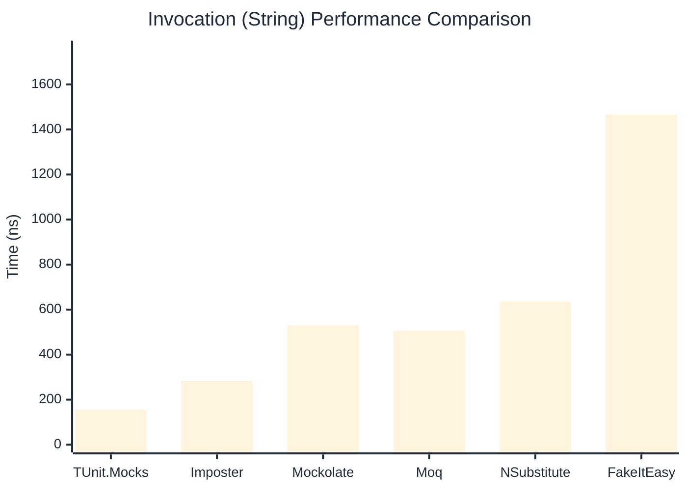
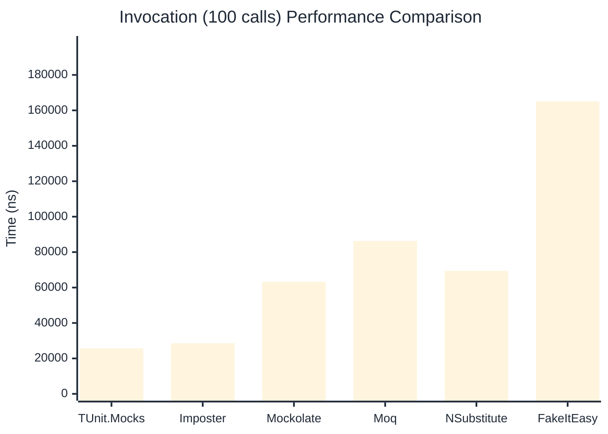

# Invocation Benchmark

:::info Last Updated
This benchmark was automatically generated on **2026-04-14** from the latest CI run.

**Environment:** Ubuntu Latest • .NET SDK 10.0.201
:::

## 📊 Results

Calling methods on mock objects:

| Library | Mean | Error | StdDev | Allocated |
|---------|------|-------|--------|-----------|
| **TUnit.Mocks** | 256.0 ns | 89.59 ns | 4.91 ns | 120 B |
| Imposter | 285.1 ns | 63.99 ns | 3.51 ns | 168 B |
| Mockolate | 634.7 ns | 69.49 ns | 3.81 ns | 640 B |
| Moq | 776.0 ns | 40.46 ns | 2.22 ns | 376 B |
| NSubstitute | 698.1 ns | 122.54 ns | 6.72 ns | 304 B |
| FakeItEasy | 1,684.6 ns | 803.74 ns | 44.06 ns | 944 B |

---

### String

| Library | Mean | Error | StdDev | Allocated |
|---------|------|-------|--------|-----------|
| **TUnit.Mocks** | 156.0 ns | 67.38 ns | 3.69 ns | 88 B |
| Imposter | 283.9 ns | 65.47 ns | 3.59 ns | 168 B |
| Mockolate | 530.1 ns | 20.11 ns | 1.10 ns | 520 B |
| Moq | 505.7 ns | 142.45 ns | 7.81 ns | 296 B |
| NSubstitute | 635.6 ns | 265.92 ns | 14.58 ns | 272 B |
| FakeItEasy | 1,466.4 ns | 265.09 ns | 14.53 ns | 776 B |

---

### 100 calls

| Library | Mean | Error | StdDev | Allocated |
|---------|------|-------|--------|-----------|
| **TUnit.Mocks** | 25,730.9 ns | 7,092.34 ns | 388.76 ns | 11936 B |
| Imposter | 28,584.7 ns | 4,220.87 ns | 231.36 ns | 16800 B |
| Mockolate | 63,248.5 ns | 21,034.16 ns | 1,152.95 ns | 64000 B |
| Moq | 86,240.5 ns | 249,782.93 ns | 13,691.45 ns | 37600 B |
| NSubstitute | 69,456.3 ns | 45,724.47 ns | 2,506.31 ns | 30848 B |
| FakeItEasy | 165,059.2 ns | 55,166.45 ns | 3,023.86 ns | 94400 B |

## 🎯 Key Insights

This benchmark compares **TUnit.Mocks** (source-generated) against runtime proxy-based mocking libraries for calling methods on mock objects.

---

:::note Methodology
View the [mock benchmarks overview](/docs/benchmarks/mocks) for methodology details and environment information.
:::

*Last generated: 2026-04-14T03:22:19.526Z*
