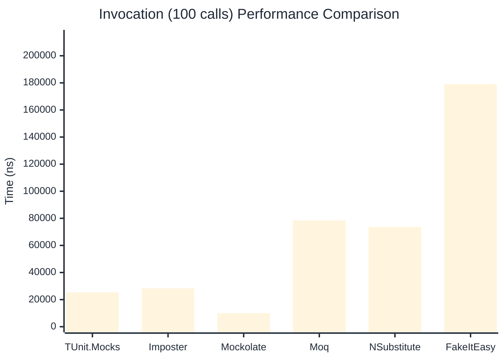

# Invocation Benchmark

:::info Last Updated
This benchmark was automatically generated on **2026-05-13** from the latest CI run.

**Environment:** Ubuntu Latest • .NET SDK 10.0.300
:::

## 📊 Results

Calling methods on mock objects:

| Library | Mean | Error | StdDev | Allocated |
|---------|------|-------|--------|-----------|
| **TUnit.Mocks** | 251.77 ns | 75.167 ns | 4.120 ns | 120 B |
| Imposter | 286.50 ns | 61.118 ns | 3.350 ns | 168 B |
| Mockolate | 98.31 ns | 12.117 ns | 0.664 ns | 84 B |
| Moq | 791.25 ns | 153.751 ns | 8.428 ns | 376 B |
| NSubstitute | 721.26 ns | 401.152 ns | 21.989 ns | 304 B |
| FakeItEasy | 1,772.96 ns | 369.217 ns | 20.238 ns | 944 B |

---

### String

| Library | Mean | Error | StdDev | Allocated |
|---------|------|-------|--------|-----------|
| **TUnit.Mocks** | 151.12 ns | 65.684 ns | 3.600 ns | 88 B |
| Imposter | 291.35 ns | 81.518 ns | 4.468 ns | 168 B |
| Mockolate | 98.20 ns | 7.569 ns | 0.415 ns | 60 B |
| Moq | 539.78 ns | 179.147 ns | 9.820 ns | 296 B |
| NSubstitute | 629.05 ns | 176.348 ns | 9.666 ns | 272 B |
| FakeItEasy | 1,594.70 ns | 154.137 ns | 8.449 ns | 776 B |

---

### 100 calls

| Library | Mean | Error | StdDev | Allocated |
|---------|------|-------|--------|-----------|
| **TUnit.Mocks** | 25,338.88 ns | 9,983.755 ns | 547.243 ns | 11936 B |
| Imposter | 28,352.41 ns | 9,418.811 ns | 516.277 ns | 16800 B |
| Mockolate | 9,987.21 ns | 1,420.547 ns | 77.865 ns | 8400 B |
| Moq | 78,412.94 ns | 7,646.834 ns | 419.149 ns | 37600 B |
| NSubstitute | 73,600.61 ns | 7,742.401 ns | 424.387 ns | 36448 B |
| FakeItEasy | 179,084.48 ns | 55,696.739 ns | 3,052.926 ns | 94400 B |

## 🎯 Key Insights

This benchmark compares **TUnit.Mocks** (source-generated) against runtime proxy-based mocking libraries for calling methods on mock objects.

---

:::note Methodology
View the [mock benchmarks overview](/docs/benchmarks/mocks) for methodology details and environment information.
:::

*Last generated: 2026-05-13T03:26:48.570Z*
