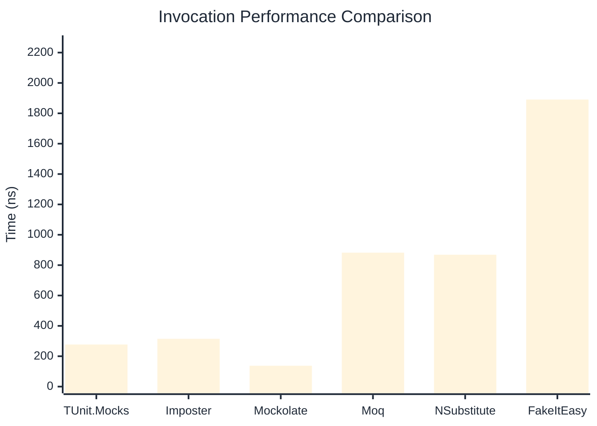

# Invocation Benchmark

> Calling methods on mock objects — comparing **TUnit.Mocks** (source-generated) against runtime proxy-based mocking libraries.

:::info Last Updated
This benchmark was automatically generated on **2026-06-13** from the latest CI run.

**Environment:** Ubuntu Latest • .NET SDK 10.0.301
:::

## 📊 Results

Calling methods on mock objects:

| Library | Mean | Error | StdDev | Allocated |
|---------|------|-------|--------|-----------|
| **TUnit.Mocks** | 277.19 ns | 79.31 ns | 4.347 ns | 128 B |
| Imposter | 314.77 ns | 82.33 ns | 4.513 ns | 168 B |
| Mockolate | 137.42 ns | 77.30 ns | 4.237 ns | 84 B |
| Moq | 882.09 ns | 54.81 ns | 3.004 ns | 376 B |
| NSubstitute | 868.76 ns | 164.58 ns | 9.021 ns | 360 B |
| FakeItEasy | 1,890.83 ns | 739.27 ns | 40.522 ns | 944 B |

---

### String

| Library | Mean | Error | StdDev | Allocated |
|---------|------|-------|--------|-----------|
| **TUnit.Mocks** | 173.47 ns | 63.26 ns | 3.467 ns | 96 B |
| Imposter | 304.13 ns | 110.33 ns | 6.048 ns | 168 B |
| Mockolate | 99.78 ns | 68.44 ns | 3.751 ns | 60 B |
| Moq | 561.43 ns | 305.40 ns | 16.740 ns | 296 B |
| NSubstitute | 604.69 ns | 203.83 ns | 11.172 ns | 272 B |
| FakeItEasy | 1,602.39 ns | 578.57 ns | 31.714 ns | 776 B |

---

### 100 calls

| Library | Mean | Error | StdDev | Allocated |
|---------|------|-------|--------|-----------|
| **TUnit.Mocks** | 26,913.74 ns | 8,778.76 ns | 481.194 ns | 12736 B |
| Imposter | 30,223.59 ns | 10,433.31 ns | 571.885 ns | 16800 B |
| Mockolate | 11,175.60 ns | 1,122.55 ns | 61.531 ns | 8400 B |
| Moq | 81,316.89 ns | 34,998.16 ns | 1,918.367 ns | 37600 B |
| NSubstitute | 73,288.45 ns | 11,770.96 ns | 645.206 ns | 30848 B |
| FakeItEasy | 182,753.41 ns | 133,081.34 ns | 7,294.637 ns | 94400 B |

## 🎯 Key Insights

This benchmark compares **TUnit.Mocks** (source-generated) against runtime proxy-based mocking libraries for calling methods on mock objects.

---

:::note Methodology
View the [mock benchmarks overview](/docs/benchmarks/mocks) for methodology details and environment information.
:::

*Last generated: 2026-06-13T03:28:23.194Z*
