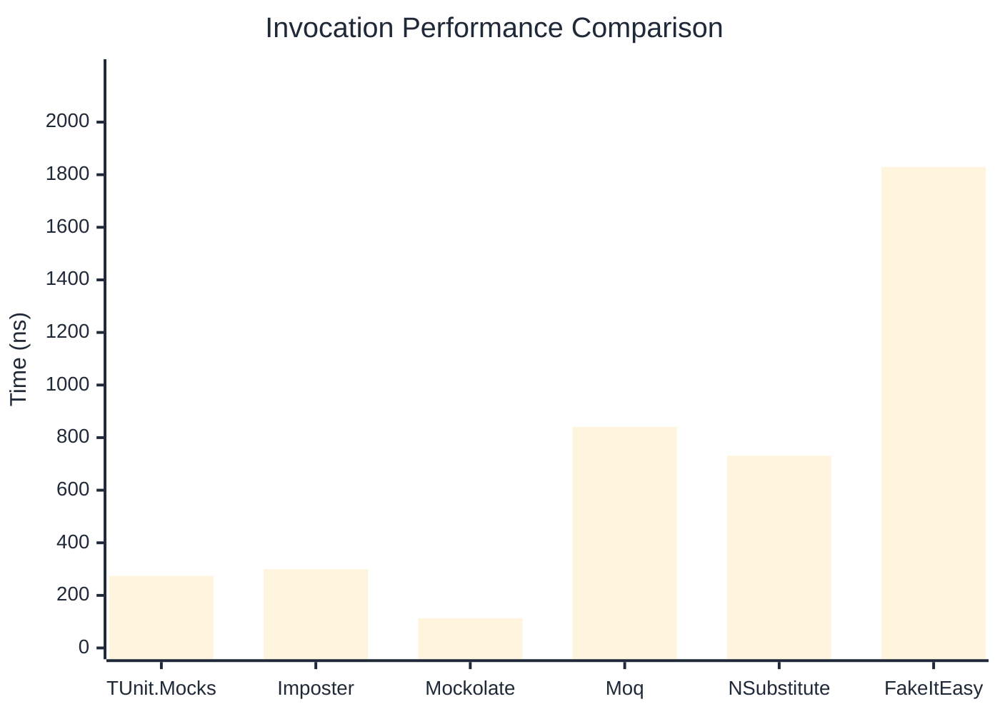

# Invocation Benchmark

> Calling methods on mock objects — comparing **TUnit.Mocks** (source-generated) against runtime proxy-based mocking libraries.

:::info Last Updated
This benchmark was automatically generated on **2026-06-27** from the latest CI run.

**Environment:** Ubuntu Latest • .NET SDK 10.0.301
:::

## 📊 Results

Calling methods on mock objects:

| Library | Mean | Error | StdDev | Allocated |
|---------|------|-------|--------|-----------|
| **TUnit.Mocks** | 274.30 ns | 84.75 ns | 4.645 ns | 128 B |
| Imposter | 299.71 ns | 102.19 ns | 5.601 ns | 168 B |
| Mockolate | 113.03 ns | 91.96 ns | 5.041 ns | 84 B |
| Moq | 840.74 ns | 384.87 ns | 21.096 ns | 376 B |
| NSubstitute | 731.26 ns | 410.40 ns | 22.495 ns | 304 B |
| FakeItEasy | 1,829.35 ns | 665.19 ns | 36.461 ns | 944 B |

---

### String

| Library | Mean | Error | StdDev | Allocated |
|---------|------|-------|--------|-----------|
| **TUnit.Mocks** | 164.97 ns | 83.03 ns | 4.551 ns | 96 B |
| Imposter | 297.64 ns | 37.45 ns | 2.053 ns | 168 B |
| Mockolate | 98.91 ns | 61.26 ns | 3.358 ns | 60 B |
| Moq | 542.47 ns | 132.25 ns | 7.249 ns | 296 B |
| NSubstitute | 617.86 ns | 221.96 ns | 12.167 ns | 272 B |
| FakeItEasy | 1,646.66 ns | 530.99 ns | 29.105 ns | 776 B |

---

### 100 calls

| Library | Mean | Error | StdDev | Allocated |
|---------|------|-------|--------|-----------|
| **TUnit.Mocks** | 27,510.06 ns | 12,122.14 ns | 664.455 ns | 12736 B |
| Imposter | 29,165.33 ns | 5,473.69 ns | 300.031 ns | 16800 B |
| Mockolate | 11,450.03 ns | 9,546.58 ns | 523.280 ns | 8400 B |
| Moq | 83,228.57 ns | 31,238.95 ns | 1,712.312 ns | 37600 B |
| NSubstitute | 73,835.14 ns | 21,865.92 ns | 1,198.545 ns | 30848 B |
| FakeItEasy | 189,604.89 ns | 43,458.06 ns | 2,382.083 ns | 94400 B |

## 🎯 Key Insights

This benchmark compares **TUnit.Mocks** (source-generated) against runtime proxy-based mocking libraries for calling methods on mock objects.

---

:::note Methodology
View the [mock benchmarks overview](/docs/benchmarks/mocks) for methodology details and environment information.
:::

*Last generated: 2026-06-27T03:27:29.619Z*
