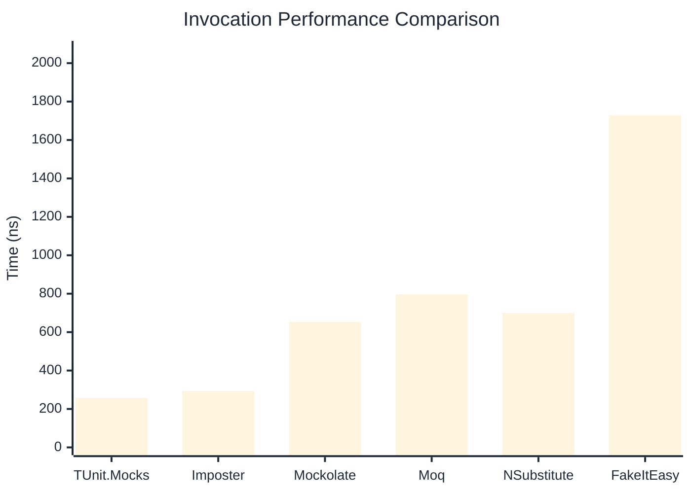

# Invocation Benchmark

:::info Last Updated
This benchmark was automatically generated on **2026-04-27** from the latest CI run.

**Environment:** Ubuntu Latest • .NET SDK 10.0.203
:::

## 📊 Results

Calling methods on mock objects:

| Library | Mean | Error | StdDev | Allocated |
|---------|------|-------|--------|-----------|
| **TUnit.Mocks** | 257.6 ns | 106.76 ns | 5.85 ns | 120 B |
| Imposter | 293.2 ns | 101.58 ns | 5.57 ns | 168 B |
| Mockolate | 653.2 ns | 38.36 ns | 2.10 ns | 640 B |
| Moq | 796.2 ns | 390.92 ns | 21.43 ns | 376 B |
| NSubstitute | 699.2 ns | 150.40 ns | 8.24 ns | 304 B |
| FakeItEasy | 1,728.9 ns | 553.18 ns | 30.32 ns | 944 B |

---

### String

| Library | Mean | Error | StdDev | Allocated |
|---------|------|-------|--------|-----------|
| **TUnit.Mocks** | 151.6 ns | 78.75 ns | 4.32 ns | 88 B |
| Imposter | 291.4 ns | 46.88 ns | 2.57 ns | 168 B |
| Mockolate | 520.5 ns | 92.24 ns | 5.06 ns | 520 B |
| Moq | 536.5 ns | 108.59 ns | 5.95 ns | 296 B |
| NSubstitute | 598.3 ns | 211.03 ns | 11.57 ns | 272 B |
| FakeItEasy | 1,551.6 ns | 353.21 ns | 19.36 ns | 776 B |

---

### 100 calls

| Library | Mean | Error | StdDev | Allocated |
|---------|------|-------|--------|-----------|
| **TUnit.Mocks** | 25,690.3 ns | 14,433.11 ns | 791.13 ns | 11936 B |
| Imposter | 28,319.9 ns | 8,767.33 ns | 480.57 ns | 16800 B |
| Mockolate | 65,761.6 ns | 22,114.30 ns | 1,212.16 ns | 64000 B |
| Moq | 79,082.1 ns | 9,211.77 ns | 504.93 ns | 37600 B |
| NSubstitute | 70,913.8 ns | 62,459.85 ns | 3,423.64 ns | 30848 B |
| FakeItEasy | 171,199.5 ns | 53,794.71 ns | 2,948.67 ns | 94400 B |

## 🎯 Key Insights

This benchmark compares **TUnit.Mocks** (source-generated) against runtime proxy-based mocking libraries for calling methods on mock objects.

---

:::note Methodology
View the [mock benchmarks overview](/docs/benchmarks/mocks) for methodology details and environment information.
:::

*Last generated: 2026-04-27T03:25:25.011Z*
