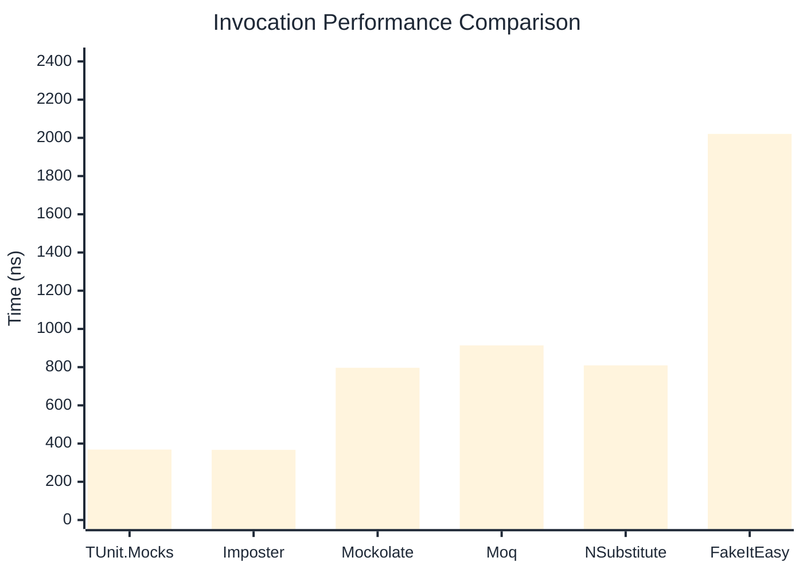

# Invocation Benchmark

:::info Last Updated
This benchmark was automatically generated on **2026-04-05** from the latest CI run.

**Environment:** Ubuntu Latest • .NET SDK 10.0.201
:::

## 📊 Results

Calling methods on mock objects:

| Library | Mean | Error | StdDev | Allocated |
|---------|------|-------|--------|-----------|
| **TUnit.Mocks** | 368.7 ns | 234.41 ns | 12.85 ns | 176 B |
| Imposter | 367.0 ns | 102.23 ns | 5.60 ns | 168 B |
| Mockolate | 796.7 ns | 374.54 ns | 20.53 ns | 640 B |
| Moq | 913.9 ns | 344.02 ns | 18.86 ns | 376 B |
| NSubstitute | 809.3 ns | 236.18 ns | 12.95 ns | 304 B |
| FakeItEasy | 2,020.7 ns | 645.01 ns | 35.35 ns | 944 B |

---

### String

| Library | Mean | Error | StdDev | Allocated |
|---------|------|-------|--------|-----------|
| **TUnit.Mocks** | 227.7 ns | 147.17 ns | 8.07 ns | 112 B |
| Imposter | 364.0 ns | 148.82 ns | 8.16 ns | 168 B |
| Mockolate | 722.7 ns | 357.53 ns | 19.60 ns | 520 B |
| Moq | 608.3 ns | 45.72 ns | 2.51 ns | 296 B |
| NSubstitute | 720.7 ns | 116.44 ns | 6.38 ns | 328 B |
| FakeItEasy | 1,753.1 ns | 715.60 ns | 39.22 ns | 776 B |

---

### 100 calls

| Library | Mean | Error | StdDev | Allocated |
|---------|------|-------|--------|-----------|
| **TUnit.Mocks** | 39,741.9 ns | 12,503.76 ns | 685.37 ns | 18048 B |
| Imposter | 37,376.4 ns | 54,157.26 ns | 2,968.54 ns | 16800 B |
| Mockolate | 77,269.3 ns | 43,532.15 ns | 2,386.14 ns | 64000 B |
| Moq | 88,134.5 ns | 65,537.69 ns | 3,592.34 ns | 37600 B |
| NSubstitute | 81,687.5 ns | 38,698.53 ns | 2,121.20 ns | 36448 B |
| FakeItEasy | 207,688.7 ns | 7,905.08 ns | 433.30 ns | 94400 B |

## 🎯 Key Insights

This benchmark compares **TUnit.Mocks** (source-generated) against runtime proxy-based mocking libraries for calling methods on mock objects.

---

:::note Methodology
View the [mock benchmarks overview](/docs/benchmarks/mocks) for methodology details and environment information.
:::

*Last generated: 2026-04-05T03:32:35.400Z*
