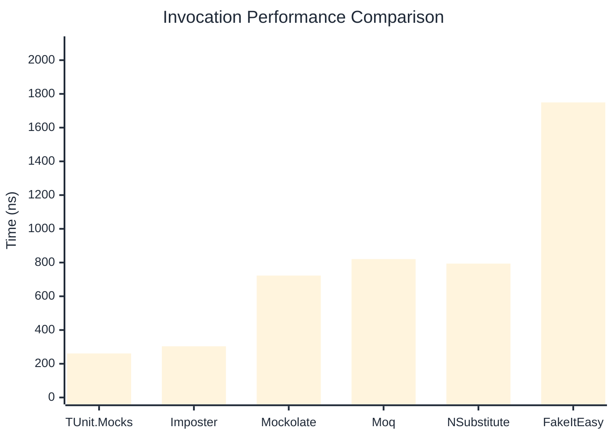
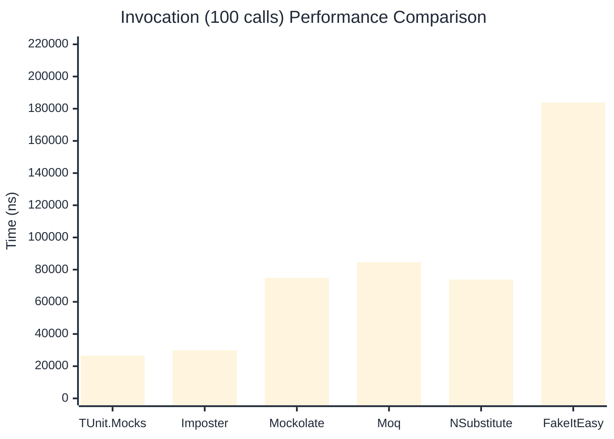

# Invocation Benchmark

:::info Last Updated
This benchmark was automatically generated on **2026-04-11** from the latest CI run.

**Environment:** Ubuntu Latest • .NET SDK 10.0.201
:::

## 📊 Results

Calling methods on mock objects:

| Library | Mean | Error | StdDev | Allocated |
|---------|------|-------|--------|-----------|
| **TUnit.Mocks** | 261.2 ns | 55.82 ns | 3.06 ns | 120 B |
| Imposter | 303.7 ns | 29.91 ns | 1.64 ns | 168 B |
| Mockolate | 722.9 ns | 387.15 ns | 21.22 ns | 640 B |
| Moq | 820.6 ns | 184.82 ns | 10.13 ns | 376 B |
| NSubstitute | 794.0 ns | 364.40 ns | 19.97 ns | 360 B |
| FakeItEasy | 1,749.6 ns | 639.15 ns | 35.03 ns | 944 B |

---

### String

| Library | Mean | Error | StdDev | Allocated |
|---------|------|-------|--------|-----------|
| **TUnit.Mocks** | 163.4 ns | 88.86 ns | 4.87 ns | 88 B |
| Imposter | 303.0 ns | 97.19 ns | 5.33 ns | 168 B |
| Mockolate | 554.2 ns | 173.06 ns | 9.49 ns | 520 B |
| Moq | 543.4 ns | 161.39 ns | 8.85 ns | 296 B |
| NSubstitute | 675.2 ns | 104.18 ns | 5.71 ns | 328 B |
| FakeItEasy | 1,654.4 ns | 366.04 ns | 20.06 ns | 776 B |

---

### 100 calls

| Library | Mean | Error | StdDev | Allocated |
|---------|------|-------|--------|-----------|
| **TUnit.Mocks** | 26,559.9 ns | 8,642.51 ns | 473.73 ns | 11936 B |
| Imposter | 29,818.9 ns | 11,162.20 ns | 611.84 ns | 16800 B |
| Mockolate | 74,846.0 ns | 50,196.70 ns | 2,751.45 ns | 64000 B |
| Moq | 84,638.7 ns | 16,469.22 ns | 902.73 ns | 37600 B |
| NSubstitute | 73,781.1 ns | 22,119.01 ns | 1,212.42 ns | 30848 B |
| FakeItEasy | 183,814.1 ns | 112,979.01 ns | 6,192.76 ns | 94400 B |

## 🎯 Key Insights

This benchmark compares **TUnit.Mocks** (source-generated) against runtime proxy-based mocking libraries for calling methods on mock objects.

---

:::note Methodology
View the [mock benchmarks overview](/docs/benchmarks/mocks) for methodology details and environment information.
:::

*Last generated: 2026-04-11T03:20:45.459Z*
