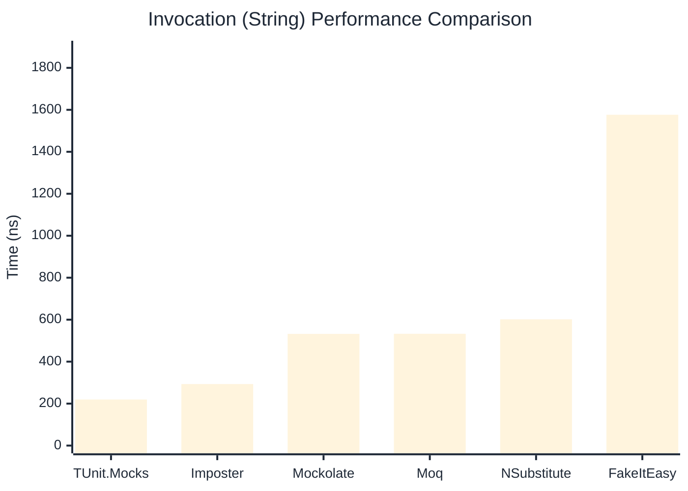

# Invocation Benchmark

:::info Last Updated
This benchmark was automatically generated on **2026-04-01** from the latest CI run.

**Environment:** Ubuntu Latest • .NET SDK 10.0.201
:::

## 📊 Results

Calling methods on mock objects:

| Library | Mean | Error | StdDev | Allocated |
|---------|------|-------|--------|-----------|
| **TUnit.Mocks** | 393.9 ns | 59.84 ns | 3.28 ns | 176 B |
| Imposter | 294.8 ns | 72.18 ns | 3.96 ns | 168 B |
| Mockolate | 657.7 ns | 71.34 ns | 3.91 ns | 640 B |
| Moq | 806.4 ns | 185.89 ns | 10.19 ns | 376 B |
| NSubstitute | 723.8 ns | 90.30 ns | 4.95 ns | 304 B |
| FakeItEasy | 1,753.4 ns | 389.59 ns | 21.35 ns | 944 B |

---

### String

| Library | Mean | Error | StdDev | Allocated |
|---------|------|-------|--------|-----------|
| **TUnit.Mocks** | 219.6 ns | 131.07 ns | 7.18 ns | 112 B |
| Imposter | 293.2 ns | 52.12 ns | 2.86 ns | 168 B |
| Mockolate | 532.1 ns | 31.58 ns | 1.73 ns | 520 B |
| Moq | 532.7 ns | 88.14 ns | 4.83 ns | 296 B |
| NSubstitute | 601.7 ns | 83.50 ns | 4.58 ns | 272 B |
| FakeItEasy | 1,576.5 ns | 214.53 ns | 11.76 ns | 776 B |

---

### 100 calls

| Library | Mean | Error | StdDev | Allocated |
|---------|------|-------|--------|-----------|
| **TUnit.Mocks** | 39,438.9 ns | 30,610.56 ns | 1,677.87 ns | 18048 B |
| Imposter | 29,080.8 ns | 7,879.74 ns | 431.92 ns | 16800 B |
| Mockolate | 66,403.9 ns | 13,919.14 ns | 762.96 ns | 64000 B |
| Moq | 79,065.6 ns | 13,997.49 ns | 767.25 ns | 37600 B |
| NSubstitute | 73,507.6 ns | 15,102.43 ns | 827.82 ns | 30848 B |
| FakeItEasy | 179,439.5 ns | 55,025.10 ns | 3,016.11 ns | 94400 B |

## 🎯 Key Insights

This benchmark compares **TUnit.Mocks** (source-generated) against runtime proxy-based mocking libraries for calling methods on mock objects.

---

:::note Methodology
View the [mock benchmarks overview](/docs/benchmarks/mocks) for methodology details and environment information.
:::

*Last generated: 2026-04-01T03:22:34.139Z*
