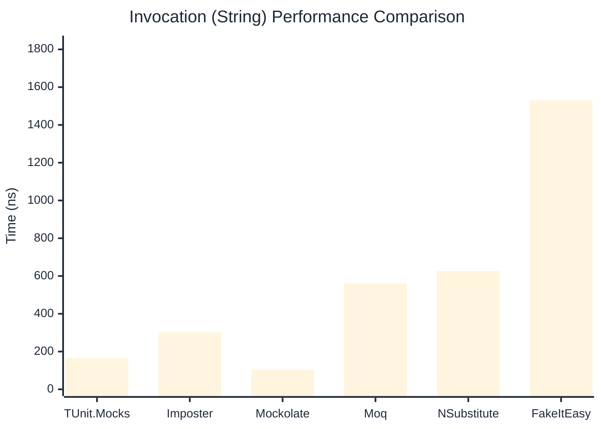

# Invocation Benchmark

> Calling methods on mock objects — comparing **TUnit.Mocks** (source-generated) against runtime proxy-based mocking libraries.

:::info Last Updated
This benchmark was automatically generated on **2026-07-11** from the latest CI run.

**Environment:** Ubuntu Latest • .NET SDK 10.0.301
:::

## 📊 Results

Calling methods on mock objects:

| Library | Mean | Error | StdDev | Allocated |
|---------|------|-------|--------|-----------|
| **TUnit.Mocks** | 277.3 ns | 82.97 ns | 4.55 ns | 128 B |
| Imposter | 298.1 ns | 128.58 ns | 7.05 ns | 168 B |
| Mockolate | 108.4 ns | 74.80 ns | 4.10 ns | 84 B |
| Moq | 787.6 ns | 111.31 ns | 6.10 ns | 376 B |
| NSubstitute | 693.6 ns | 211.37 ns | 11.59 ns | 304 B |
| FakeItEasy | 1,695.4 ns | 1,045.71 ns | 57.32 ns | 944 B |

---

### String

| Library | Mean | Error | StdDev | Allocated |
|---------|------|-------|--------|-----------|
| **TUnit.Mocks** | 164.9 ns | 69.66 ns | 3.82 ns | 96 B |
| Imposter | 301.8 ns | 119.77 ns | 6.56 ns | 168 B |
| Mockolate | 104.5 ns | 71.21 ns | 3.90 ns | 60 B |
| Moq | 560.3 ns | 110.89 ns | 6.08 ns | 296 B |
| NSubstitute | 626.0 ns | 718.08 ns | 39.36 ns | 272 B |
| FakeItEasy | 1,530.1 ns | 347.83 ns | 19.07 ns | 776 B |

---

### 100 calls

| Library | Mean | Error | StdDev | Allocated |
|---------|------|-------|--------|-----------|
| **TUnit.Mocks** | 27,611.9 ns | 11,322.91 ns | 620.65 ns | 12736 B |
| Imposter | 29,428.0 ns | 12,633.84 ns | 692.50 ns | 16800 B |
| Mockolate | 11,628.1 ns | 7,194.61 ns | 394.36 ns | 8400 B |
| Moq | 77,825.3 ns | 25,431.88 ns | 1,394.01 ns | 37600 B |
| NSubstitute | 71,167.1 ns | 33,326.88 ns | 1,826.76 ns | 30848 B |
| FakeItEasy | 176,167.2 ns | 104,799.39 ns | 5,744.41 ns | 94400 B |

## 🎯 Key Insights

This benchmark compares **TUnit.Mocks** (source-generated) against runtime proxy-based mocking libraries for calling methods on mock objects.

---

:::note Methodology
View the [mock benchmarks overview](/docs/benchmarks/mocks) for methodology details and environment information.
:::

*Last generated: 2026-07-11T03:21:26.661Z*
