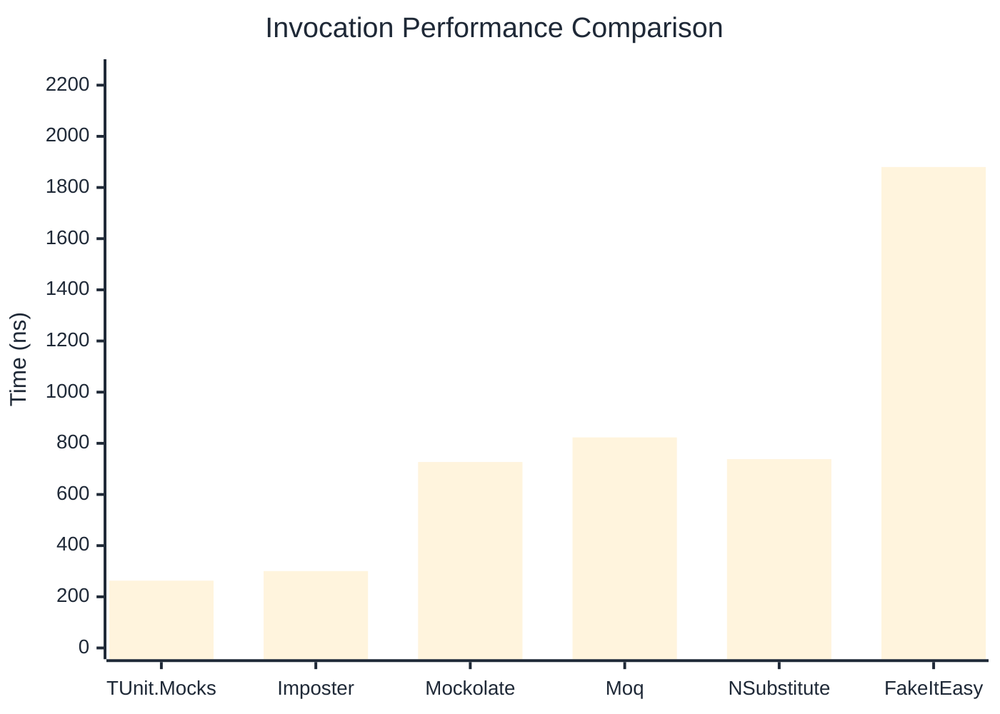

# Invocation Benchmark

:::info Last Updated
This benchmark was automatically generated on **2026-04-10** from the latest CI run.

**Environment:** Ubuntu Latest • .NET SDK 10.0.201
:::

## 📊 Results

Calling methods on mock objects:

| Library | Mean | Error | StdDev | Allocated |
|---------|------|-------|--------|-----------|
| **TUnit.Mocks** | 263.1 ns | 54.19 ns | 2.97 ns | 120 B |
| Imposter | 300.6 ns | 60.84 ns | 3.34 ns | 168 B |
| Mockolate | 726.9 ns | 376.67 ns | 20.65 ns | 640 B |
| Moq | 823.1 ns | 171.25 ns | 9.39 ns | 376 B |
| NSubstitute | 738.0 ns | 200.83 ns | 11.01 ns | 304 B |
| FakeItEasy | 1,880.1 ns | 649.38 ns | 35.59 ns | 944 B |

---

### String

| Library | Mean | Error | StdDev | Allocated |
|---------|------|-------|--------|-----------|
| **TUnit.Mocks** | 164.9 ns | 56.61 ns | 3.10 ns | 88 B |
| Imposter | 303.3 ns | 61.07 ns | 3.35 ns | 168 B |
| Mockolate | 566.5 ns | 111.49 ns | 6.11 ns | 520 B |
| Moq | 571.0 ns | 129.78 ns | 7.11 ns | 296 B |
| NSubstitute | 640.6 ns | 227.93 ns | 12.49 ns | 272 B |
| FakeItEasy | 1,784.2 ns | 3,412.14 ns | 187.03 ns | 776 B |

---

### 100 calls

| Library | Mean | Error | StdDev | Allocated |
|---------|------|-------|--------|-----------|
| **TUnit.Mocks** | 26,621.9 ns | 9,169.88 ns | 502.63 ns | 11936 B |
| Imposter | 29,872.4 ns | 9,791.92 ns | 536.73 ns | 16800 B |
| Mockolate | 72,191.1 ns | 4,393.94 ns | 240.85 ns | 64000 B |
| Moq | 84,474.3 ns | 5,510.80 ns | 302.07 ns | 37600 B |
| NSubstitute | 76,453.2 ns | 31,449.98 ns | 1,723.88 ns | 30848 B |
| FakeItEasy | 188,329.9 ns | 18,306.80 ns | 1,003.46 ns | 94400 B |

## 🎯 Key Insights

This benchmark compares **TUnit.Mocks** (source-generated) against runtime proxy-based mocking libraries for calling methods on mock objects.

---

:::note Methodology
View the [mock benchmarks overview](/docs/benchmarks/mocks) for methodology details and environment information.
:::

*Last generated: 2026-04-10T03:23:10.636Z*
