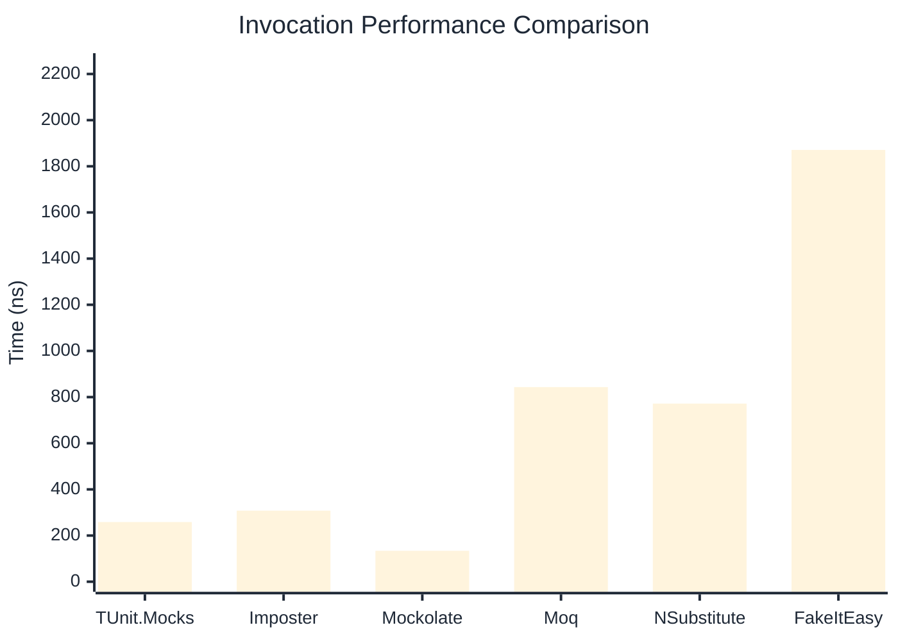

# Invocation Benchmark

:::info Last Updated
This benchmark was automatically generated on **2026-05-12** from the latest CI run.

**Environment:** Ubuntu Latest • .NET SDK 10.0.203
:::

## 📊 Results

Calling methods on mock objects:

| Library | Mean | Error | StdDev | Allocated |
|---------|------|-------|--------|-----------|
| **TUnit.Mocks** | 258.5 ns | 57.68 ns | 3.16 ns | 120 B |
| Imposter | 307.9 ns | 38.47 ns | 2.11 ns | 168 B |
| Mockolate | 134.0 ns | 27.66 ns | 1.52 ns | 84 B |
| Moq | 843.4 ns | 204.08 ns | 11.19 ns | 376 B |
| NSubstitute | 771.7 ns | 389.25 ns | 21.34 ns | 304 B |
| FakeItEasy | 1,871.0 ns | 833.60 ns | 45.69 ns | 944 B |

---

### String

| Library | Mean | Error | StdDev | Allocated |
|---------|------|-------|--------|-----------|
| **TUnit.Mocks** | 156.5 ns | 59.48 ns | 3.26 ns | 88 B |
| Imposter | 306.4 ns | 121.24 ns | 6.65 ns | 168 B |
| Mockolate | 103.2 ns | 18.40 ns | 1.01 ns | 60 B |
| Moq | 550.5 ns | 80.30 ns | 4.40 ns | 296 B |
| NSubstitute | 652.2 ns | 39.06 ns | 2.14 ns | 328 B |
| FakeItEasy | 1,618.1 ns | 213.45 ns | 11.70 ns | 776 B |

---

### 100 calls

| Library | Mean | Error | StdDev | Allocated |
|---------|------|-------|--------|-----------|
| **TUnit.Mocks** | 26,294.1 ns | 17,063.80 ns | 935.32 ns | 11936 B |
| Imposter | 30,180.5 ns | 12,144.41 ns | 665.68 ns | 16800 B |
| Mockolate | 12,851.0 ns | 6,662.86 ns | 365.21 ns | 8400 B |
| Moq | 81,626.3 ns | 33,939.02 ns | 1,860.31 ns | 37600 B |
| NSubstitute | 75,373.2 ns | 7,658.55 ns | 419.79 ns | 30848 B |
| FakeItEasy | 188,367.5 ns | 33,064.95 ns | 1,812.40 ns | 94400 B |

## 🎯 Key Insights

This benchmark compares **TUnit.Mocks** (source-generated) against runtime proxy-based mocking libraries for calling methods on mock objects.

---

:::note Methodology
View the [mock benchmarks overview](/docs/benchmarks/mocks) for methodology details and environment information.
:::

*Last generated: 2026-05-12T03:27:02.666Z*
