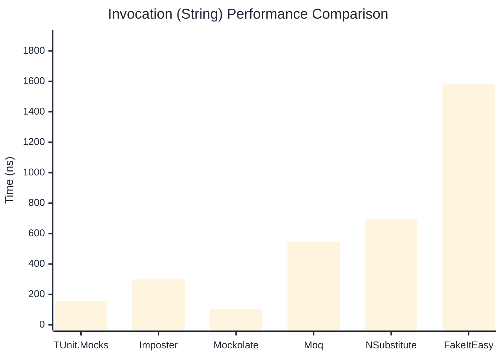

# Invocation Benchmark

:::info Last Updated
This benchmark was automatically generated on **2026-05-14** from the latest CI run.

**Environment:** Ubuntu Latest • .NET SDK 10.0.300
:::

## 📊 Results

Calling methods on mock objects:

| Library | Mean | Error | StdDev | Allocated |
|---------|------|-------|--------|-----------|
| **TUnit.Mocks** | 256.6 ns | 66.95 ns | 3.67 ns | 120 B |
| Imposter | 302.7 ns | 74.46 ns | 4.08 ns | 168 B |
| Mockolate | 108.1 ns | 18.49 ns | 1.01 ns | 84 B |
| Moq | 838.3 ns | 626.28 ns | 34.33 ns | 376 B |
| NSubstitute | 733.4 ns | 206.80 ns | 11.34 ns | 304 B |
| FakeItEasy | 1,846.6 ns | 917.95 ns | 50.32 ns | 944 B |

---

### String

| Library | Mean | Error | StdDev | Allocated |
|---------|------|-------|--------|-----------|
| **TUnit.Mocks** | 158.3 ns | 57.57 ns | 3.16 ns | 88 B |
| Imposter | 298.9 ns | 75.07 ns | 4.11 ns | 168 B |
| Mockolate | 104.9 ns | 70.09 ns | 3.84 ns | 60 B |
| Moq | 546.4 ns | 50.57 ns | 2.77 ns | 296 B |
| NSubstitute | 693.2 ns | 334.09 ns | 18.31 ns | 328 B |
| FakeItEasy | 1,585.0 ns | 377.74 ns | 20.71 ns | 776 B |

---

### 100 calls

| Library | Mean | Error | StdDev | Allocated |
|---------|------|-------|--------|-----------|
| **TUnit.Mocks** | 25,534.5 ns | 10,874.64 ns | 596.08 ns | 11936 B |
| Imposter | 29,698.5 ns | 7,874.65 ns | 431.64 ns | 16800 B |
| Mockolate | 11,329.0 ns | 7,752.97 ns | 424.97 ns | 8400 B |
| Moq | 80,134.7 ns | 33,184.21 ns | 1,818.94 ns | 37600 B |
| NSubstitute | 77,699.9 ns | 118,763.40 ns | 6,509.82 ns | 30848 B |
| FakeItEasy | 179,977.1 ns | 7,621.18 ns | 417.74 ns | 94400 B |

## 🎯 Key Insights

This benchmark compares **TUnit.Mocks** (source-generated) against runtime proxy-based mocking libraries for calling methods on mock objects.

---

:::note Methodology
View the [mock benchmarks overview](/docs/benchmarks/mocks) for methodology details and environment information.
:::

*Last generated: 2026-05-14T03:27:14.658Z*
