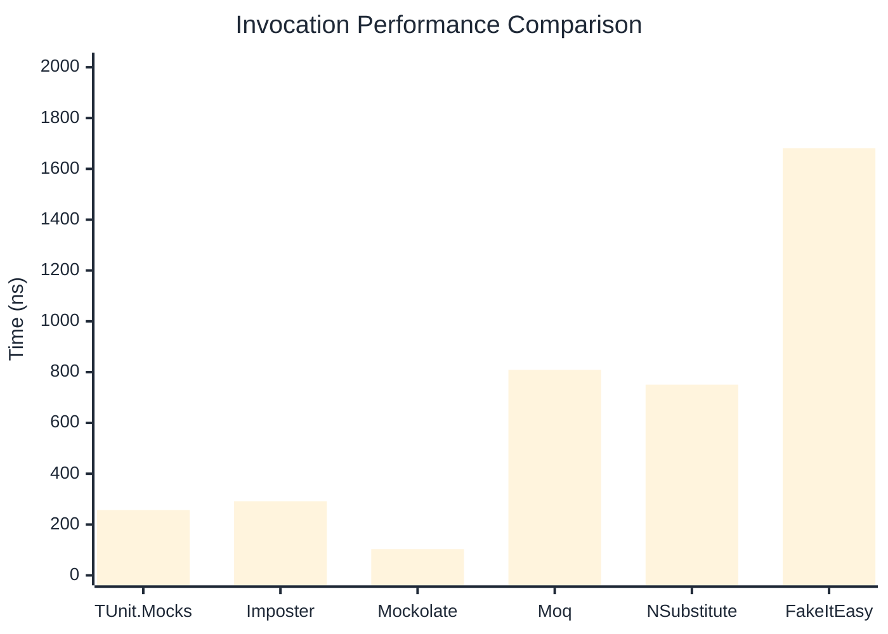

# Invocation Benchmark

:::info Last Updated
This benchmark was automatically generated on **2026-05-09** from the latest CI run.

**Environment:** Ubuntu Latest • .NET SDK 10.0.203
:::

## 📊 Results

Calling methods on mock objects:

| Library | Mean | Error | StdDev | Allocated |
|---------|------|-------|--------|-----------|
| **TUnit.Mocks** | 257.20 ns | 50.18 ns | 2.750 ns | 120 B |
| Imposter | 291.84 ns | 54.94 ns | 3.011 ns | 168 B |
| Mockolate | 103.05 ns | 35.89 ns | 1.967 ns | 84 B |
| Moq | 808.89 ns | 145.36 ns | 7.968 ns | 376 B |
| NSubstitute | 750.83 ns | 135.68 ns | 7.437 ns | 304 B |
| FakeItEasy | 1,681.17 ns | 277.61 ns | 15.217 ns | 944 B |

---

### String

| Library | Mean | Error | StdDev | Allocated |
|---------|------|-------|--------|-----------|
| **TUnit.Mocks** | 154.58 ns | 67.64 ns | 3.707 ns | 88 B |
| Imposter | 288.96 ns | 83.81 ns | 4.594 ns | 168 B |
| Mockolate | 92.27 ns | 28.66 ns | 1.571 ns | 60 B |
| Moq | 529.01 ns | 142.19 ns | 7.794 ns | 296 B |
| NSubstitute | 592.89 ns | 185.10 ns | 10.146 ns | 272 B |
| FakeItEasy | 1,548.80 ns | 525.05 ns | 28.780 ns | 776 B |

---

### 100 calls

| Library | Mean | Error | StdDev | Allocated |
|---------|------|-------|--------|-----------|
| **TUnit.Mocks** | 25,534.52 ns | 13,474.40 ns | 738.577 ns | 11936 B |
| Imposter | 29,154.60 ns | 5,715.53 ns | 313.287 ns | 16800 B |
| Mockolate | 10,133.99 ns | 3,730.65 ns | 204.489 ns | 8400 B |
| Moq | 78,721.53 ns | 20,079.59 ns | 1,100.630 ns | 37600 B |
| NSubstitute | 69,241.55 ns | 26,660.34 ns | 1,461.343 ns | 30848 B |
| FakeItEasy | 169,727.73 ns | 63,097.85 ns | 3,458.606 ns | 94400 B |

## 🎯 Key Insights

This benchmark compares **TUnit.Mocks** (source-generated) against runtime proxy-based mocking libraries for calling methods on mock objects.

---

:::note Methodology
View the [mock benchmarks overview](/docs/benchmarks/mocks) for methodology details and environment information.
:::

*Last generated: 2026-05-09T03:26:33.451Z*
