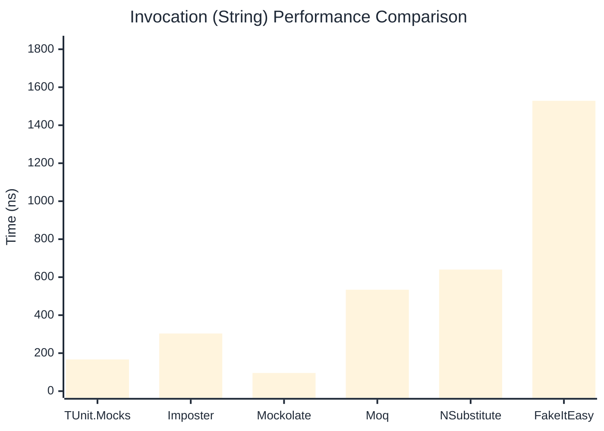

# Invocation Benchmark

> Calling methods on mock objects — comparing **TUnit.Mocks** (source-generated) against runtime proxy-based mocking libraries.

:::info Last Updated
This benchmark was automatically generated on **2026-07-15** from the latest CI run.

**Environment:** Ubuntu Latest • .NET SDK 10.0.302
:::

## 📊 Results

Calling methods on mock objects:

| Library | Mean | Error | StdDev | Allocated |
|---------|------|-------|--------|-----------|
| **TUnit.Mocks** | 278.50 ns | 86.19 ns | 4.724 ns | 128 B |
| Imposter | 304.45 ns | 87.85 ns | 4.815 ns | 168 B |
| Mockolate | 116.07 ns | 30.08 ns | 1.649 ns | 84 B |
| Moq | 862.75 ns | 92.34 ns | 5.062 ns | 376 B |
| NSubstitute | 736.92 ns | 158.00 ns | 8.661 ns | 304 B |
| FakeItEasy | 1,867.83 ns | 445.71 ns | 24.431 ns | 944 B |

---

### String

| Library | Mean | Error | StdDev | Allocated |
|---------|------|-------|--------|-----------|
| **TUnit.Mocks** | 166.80 ns | 71.65 ns | 3.927 ns | 96 B |
| Imposter | 303.54 ns | 91.78 ns | 5.031 ns | 168 B |
| Mockolate | 95.62 ns | 65.65 ns | 3.599 ns | 60 B |
| Moq | 533.94 ns | 330.76 ns | 18.130 ns | 296 B |
| NSubstitute | 640.03 ns | 109.83 ns | 6.020 ns | 272 B |
| FakeItEasy | 1,528.67 ns | 641.60 ns | 35.169 ns | 776 B |

---

### 100 calls

| Library | Mean | Error | StdDev | Allocated |
|---------|------|-------|--------|-----------|
| **TUnit.Mocks** | 26,850.40 ns | 13,767.19 ns | 754.626 ns | 12736 B |
| Imposter | 28,782.98 ns | 8,291.96 ns | 454.510 ns | 16800 B |
| Mockolate | 10,047.18 ns | 7,098.10 ns | 389.071 ns | 8400 B |
| Moq | 78,996.11 ns | 23,285.79 ns | 1,276.373 ns | 37600 B |
| NSubstitute | 71,259.47 ns | 4,243.71 ns | 232.612 ns | 30848 B |
| FakeItEasy | 181,169.39 ns | 97,204.42 ns | 5,328.102 ns | 94400 B |

## 🎯 Key Insights

This benchmark compares **TUnit.Mocks** (source-generated) against runtime proxy-based mocking libraries for calling methods on mock objects.

---

:::note Methodology
View the [mock benchmarks overview](/docs/benchmarks/mocks) for methodology details and environment information.
:::

*Last generated: 2026-07-15T03:20:35.055Z*
