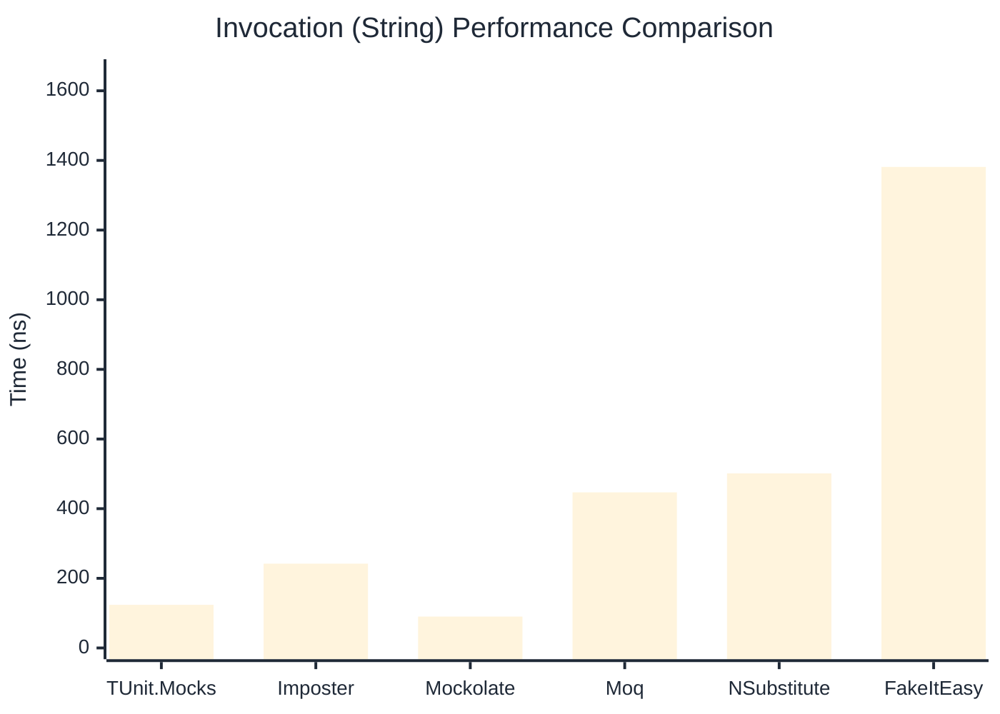

# Invocation Benchmark

:::info Last Updated
This benchmark was automatically generated on **2026-05-16** from the latest CI run.

**Environment:** Ubuntu Latest • .NET SDK 10.0.300
:::

## 📊 Results

Calling methods on mock objects:

| Library | Mean | Error | StdDev | Allocated |
|---------|------|-------|--------|-----------|
| **TUnit.Mocks** | 205.50 ns | 105.00 ns | 5.755 ns | 120 B |
| Imposter | 238.53 ns | 25.83 ns | 1.416 ns | 168 B |
| Mockolate | 114.73 ns | 139.62 ns | 7.653 ns | 84 B |
| Moq | 694.27 ns | 331.08 ns | 18.148 ns | 376 B |
| NSubstitute | 612.35 ns | 185.33 ns | 10.158 ns | 304 B |
| FakeItEasy | 1,550.47 ns | 42.35 ns | 2.321 ns | 944 B |

---

### String

| Library | Mean | Error | StdDev | Allocated |
|---------|------|-------|--------|-----------|
| **TUnit.Mocks** | 123.91 ns | 47.71 ns | 2.615 ns | 88 B |
| Imposter | 242.03 ns | 17.62 ns | 0.966 ns | 168 B |
| Mockolate | 90.13 ns | 41.22 ns | 2.259 ns | 60 B |
| Moq | 446.79 ns | 46.14 ns | 2.529 ns | 296 B |
| NSubstitute | 501.31 ns | 113.27 ns | 6.209 ns | 272 B |
| FakeItEasy | 1,381.35 ns | 217.17 ns | 11.904 ns | 776 B |

---

### 100 calls

| Library | Mean | Error | StdDev | Allocated |
|---------|------|-------|--------|-----------|
| **TUnit.Mocks** | 20,457.73 ns | 8,784.57 ns | 481.512 ns | 11936 B |
| Imposter | 23,676.40 ns | 1,598.40 ns | 87.614 ns | 16800 B |
| Mockolate | 10,106.63 ns | 809.43 ns | 44.367 ns | 8400 B |
| Moq | 66,385.12 ns | 4,143.96 ns | 227.145 ns | 37600 B |
| NSubstitute | 62,071.84 ns | 8,427.73 ns | 461.952 ns | 30848 B |
| FakeItEasy | 155,083.57 ns | 23,884.55 ns | 1,309.193 ns | 94400 B |

## 🎯 Key Insights

This benchmark compares **TUnit.Mocks** (source-generated) against runtime proxy-based mocking libraries for calling methods on mock objects.

---

:::note Methodology
View the [mock benchmarks overview](/docs/benchmarks/mocks) for methodology details and environment information.
:::

*Last generated: 2026-05-16T03:25:52.400Z*
