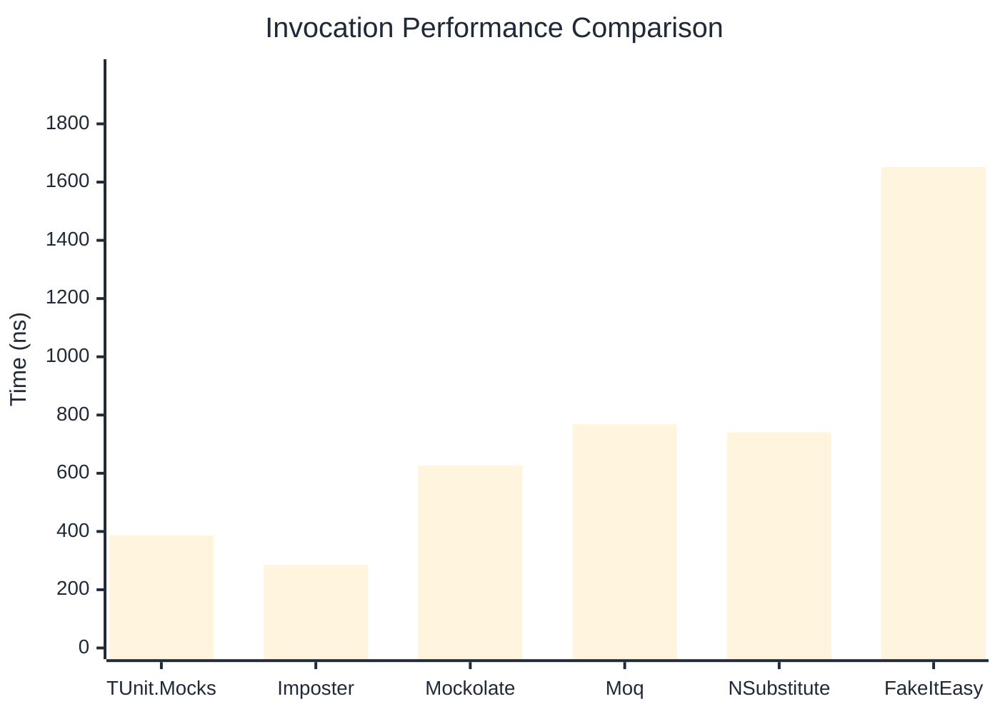
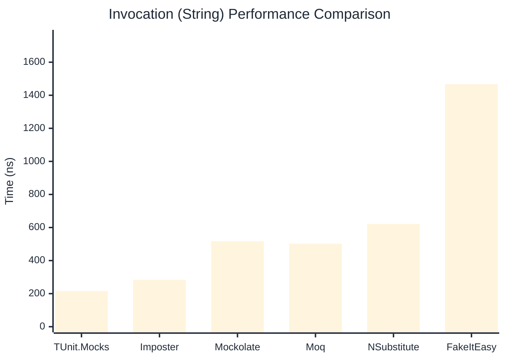

# Invocation Benchmark

:::info Last Updated
This benchmark was automatically generated on **2026-04-04** from the latest CI run.

**Environment:** Ubuntu Latest • .NET SDK 10.0.201
:::

## 📊 Results

Calling methods on mock objects:

| Library | Mean | Error | StdDev | Allocated |
|---------|------|-------|--------|-----------|
| **TUnit.Mocks** | 386.9 ns | 23.74 ns | 1.30 ns | 176 B |
| Imposter | 285.8 ns | 83.31 ns | 4.57 ns | 168 B |
| Mockolate | 626.9 ns | 76.97 ns | 4.22 ns | 640 B |
| Moq | 768.1 ns | 5.56 ns | 0.30 ns | 376 B |
| NSubstitute | 740.2 ns | 76.84 ns | 4.21 ns | 360 B |
| FakeItEasy | 1,651.9 ns | 335.16 ns | 18.37 ns | 944 B |

---

### String

| Library | Mean | Error | StdDev | Allocated |
|---------|------|-------|--------|-----------|
| **TUnit.Mocks** | 216.0 ns | 135.97 ns | 7.45 ns | 112 B |
| Imposter | 283.1 ns | 56.43 ns | 3.09 ns | 168 B |
| Mockolate | 516.6 ns | 89.56 ns | 4.91 ns | 520 B |
| Moq | 501.6 ns | 84.92 ns | 4.66 ns | 296 B |
| NSubstitute | 621.3 ns | 91.55 ns | 5.02 ns | 328 B |
| FakeItEasy | 1,467.2 ns | 17.20 ns | 0.94 ns | 776 B |

---

### 100 calls

| Library | Mean | Error | StdDev | Allocated |
|---------|------|-------|--------|-----------|
| **TUnit.Mocks** | 37,670.7 ns | 18,930.65 ns | 1,037.65 ns | 18048 B |
| Imposter | 28,657.8 ns | 9,168.83 ns | 502.57 ns | 16800 B |
| Mockolate | 63,064.9 ns | 12,184.36 ns | 667.87 ns | 64000 B |
| Moq | 76,035.0 ns | 11,883.70 ns | 651.39 ns | 37600 B |
| NSubstitute | 73,001.9 ns | 22,947.43 ns | 1,257.83 ns | 36448 B |
| FakeItEasy | 166,460.0 ns | 32,758.52 ns | 1,795.61 ns | 94400 B |

## 🎯 Key Insights

This benchmark compares **TUnit.Mocks** (source-generated) against runtime proxy-based mocking libraries for calling methods on mock objects.

---

:::note Methodology
View the [mock benchmarks overview](/docs/benchmarks/mocks) for methodology details and environment information.
:::

*Last generated: 2026-04-04T03:18:30.135Z*
